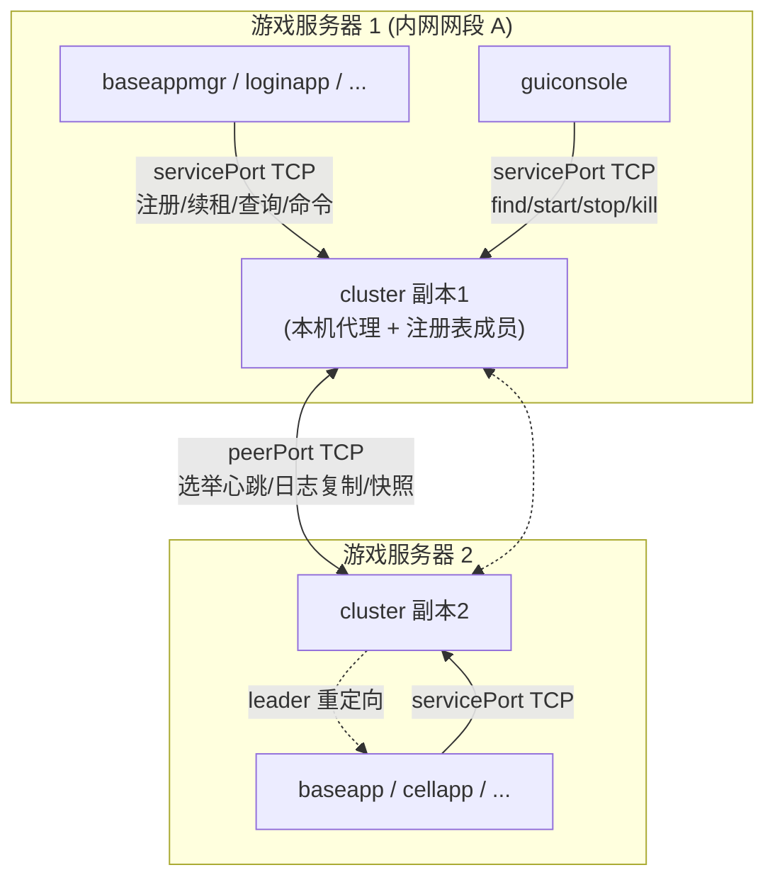

# KBEngine cluster 集群替换 Machine 设计文档

> 状态：设计中（随实现更新）
> 适用范围：本仓库 `kbe/` 引擎源码 + `balls_server_assets` demo 工程
> 相关代号：cluster（集群组件）、machine（被替代对象，`kbe_Machine`）

---

## 1. 背景与目标

原 KBEngine 用 **每物理机一个 `kbe_Machine` 进程 + 局域网 UDP 广播/单播** 完成服务注册与发现：

- 组件启动时向 `machine_addresses`（XML `<machine><addresses>`）广播自身 25 个字段（`machine_interface.h` 的 `onBroadcastInterface`），各 machine **只登记本机进程**；
- 组件找目标组件时广播 `onFindInterfaceAddr`，**只有目标组件所在机器的 machine 应答**；
- machine 用“本机进程表（pid 存活）”判断组件是否存活，**不是心跳/租约**；
- machine 还承担 guiconsole 的远程起停（`startserver/stopserver/killserver`）。

现状弱点：

| 问题 | 影响 |
|---|---|
| 依赖 UDP 广播组网 | 跨网段/跨机房部署困难，路由器屏蔽广播即失败 |
| 无持久化、无强一致 | machine 重启丢全局注册表；发现结果依赖“谁先应答” |
| 单机归属 + 本机进程表存活判定 | 机器崩溃/网络分区无法及时发现远端组件下线 |
| 无线性一致 API | 外部系统/控制台无法获得权威的全局视图 |

### 目标（用户已确认的决策）

1. **引擎内自研**高可用 cluster 集群进程（多副本 + 选主/同步），**不引入 etcd/Consul/ZooKeeper/Raft 等外部依赖**；
2. cluster **完全替代** `kbe_Machine`：不再需要运行 machine，老协议/老代码逐步删除；
3. cluster 承接职责：
   - 组件注册 / 发现 / 启动引导查询（find）；
   - 远程起停指令 `startserver / stopserver / killserver`（guiconsole 一键起服/关服）。
4. cluster **不承接**（明确取舍）：
   - `queryComponentID` 中央 ID 分配 → 改为本地确定性生成 + 注册冲突检测；
   - `queryLoad / onQueryMachines / lookApp` 机器资源/负载监控 → 相关 guiconsole 视图在无 machine 后失效（已知局限）。
5. 交付：**设计文档 + 本仓库源码改造**（Linux Makefile 与 Windows vcxproj/sln 双平台构建、示例配置、启动冒烟/故障演练）。

---

## 2. 总体架构



要点：

- **组件/工具 → cluster 层**：全部走 **TCP 直连**（弃用 UDP 广播），统一入口是任意副本的 `servicePort`。组件从 XML `<cluster><addresses>` 得到成员 IP 列表，依次尝试，直到收到响应；非 leader 副本在响应里回 `REDIRECT + leader 地址`，客户端据此重连。
- **副本之间层**：走 `peerPort` TCP，实现极简 Raft 子集（选举 + 心跳 + 日志复制 + majority 提交 + 快照）。
- **本机代理**：每副本同时是“本机代理”。`startserver/stopserver/killserver` 的目标组件在副本 X 的机器上，则由 **X 副本** 在本机拉起/杀停进程（迁移原 machine 的 `startWindowsProcess/startLinuxProcess` 逻辑），结果回报 leader。
- 每台部署 cluster 副本的机器一个进程；副本成员数量建议 ≥3（多数派容错），最少 1（单机模式退化为“高可用注册中心”但不满足一致性容错）。

### 端口规划

| 名称 | 默认值 | 常量/位置 | 说明 |
|---|---|---|---|
| servicePort | 20093 | `ENGINE_COMPONENT_INFO::clusterServicePort`，XML `<cluster><servicePort>` | 组件/工具连接的 TCP 服务端口 |
| peerPort | 20094 | `ENGINE_COMPONENT_INFO::clusterPeerPort`，XML `<cluster><peerPort>` | 副本间一致性通信端口 |
| （machine 遗留） | 20086/20087/20088 | `network/common.h` | 随 machine 删除逐步清理 |

> 注意：20093/20094 落在 `KBE_PORT_START(20000)+93/+94`，不与现有引擎常量（+87 广播发现、+88 machine TCP）冲突；端口均可在 XML 覆盖，多副本跨机部署各机使用相同端口（各自本机绑定）。

---

## 3. cluster 进程

### 3.1 进程骨架

仿 `kbe/src/server/machine` 工程，新增目录 `kbe/src/server/cluster`：

- `cluster.h/.cpp`：`class Cluster : public ServerApp, public Singleton<Cluster>`
- `cluster_interface.h/.cpp`：组件/工具侧请求（服务面）
- `cluster_peer_interface.h/.cpp`：副本间消息（一致性面）
- `main.cpp`：入口，`KBENGINE_MAIN` + `kbeMainT<Cluster>(..., CLUSTER_TYPE, ...)`
- `Makefile` / `cluster.vcxproj` / `.filters`：仿 machine 工程（`-DKBE_CLUSTER`）

类型扩展（已完成）：`CLUSTER_TYPE = 15`，`COMPONENT_END_TYPE = 16`，四张名称表尾部追加 `"cluster"`。所有旧类型编号不变。

### 3.2 模块划分

| 模块 | 职责 | 参考来源 |
|---|---|---|
| RaftCore（一致性） | term/角色/选举超时/投票/心跳/AppendEntries/commit/snapshot | 自研极简 Raft |
| RegistryStateMachine | 注册表状态机：apply 命令到内存表、TTL 清理、find | 原 machine `Components` 语义 |
| ServiceServer | `servicePort` TCP 服务：接收组件/工具请求，经 leader 线性一致处理，响应/重定向 | 原 `MachineInterface` 消息语义 |
| PeerServer | `peerPort` TCP 服务：副本间选票/心跳/日志/快照 | — |
| LocalAgent（本机代理） | 在本机启动/杀停游戏进程 | 原 machine `startserver/stopserver/killserver` 实现 |
| SnapshotStore | 快照落盘/启动恢复/新副本追平 | — |

### 3.3 线程模型

cluster 进程主线程运行引擎 `EventDispatcher`（`ServerApp` 主循环）。为保证一致性状态机单线程语义：

- 两个 listener 使用**独立 accept 线程 + 每连接处理线程**，只负责网络读写与协议编解码；
- 所有“写/查状态机”的操作封装为 **Command**，投递到主线程命令队列；
- 主循环 tick 中批量执行队列内命令并提交到状态机（Raft apply），再统一发响应；
- 队列使用互斥锁保护；状态机只被主线程访问，无需额外锁。

### 3.4 状态持久化

- 每个副本在本地落盘：`currentTerm`、`votedFor`、已提交日志索引、最新快照与日志段；
- 快照内容为整个注册表（分量小，几十~几百条），定期触发（如每 100 条命令或 30s）并截断日志；
- 新副本 / 落后副本从 leader 拉取快照 + 增量日志追平。

---

## 4. 一致性协议（极简 Raft 子集）

不引入第三方库，按标准 Raft 论文子集实现，满足“低频、小数据、高可用”的注册表场景。

### 4.1 术语与状态

- `currentTerm`：单调递增；副本收到更高 term 即退位为 follower。
- 角色：`LEADER / CANDIDATE / FOLLOWER`。
- 持久状态：`currentTerm, votedFor, log[]`；易失：`commitIndex, lastApplied`。
- 成员（配置）：由 XML `<cluster><addresses>` 的顺序决定成员序号 `0..N-1`，每副本运行前必须**加载并校验同一份成员列表**（防止配置漂移造成的脑裂）。

### 4.2 选举

- 选举超时 = `electionTimeout`（默认 3000ms），实际值在 `[T, T*1.66)` 随机抖动，防同时超时活锁；
- follower 超时未收到 leader 心跳 → term+1 → candidate，向所有其它成员发 `RequestVote`；
- 得票 ≥ `majority = N/2 + 1` 即成为 leader，广播 `AppendEntries`（空日志即心跳）确立权威；
- `votedFor` 保证一个 term 内一票制。

### 4.3 心跳与日志复制

- leader 每 `heartbeatInterval`（默认 1000ms）向所有 follower 发 `AppendEntries(prevLogIndex, entries[], leaderCommit)`；
- 组件注册/注销/续租/起停命令统一追加为日志项，**majority 副本持久化成功即提交（apply 到状态机）并回包客户端**；
- follower 匹配失败按 index 回退重试（nextIndex 递减），日志冲突段覆盖为 leader 版本；
- 心跳/续租小包均为低频，不产生带宽压力。

### 4.4 读一致性

- **读写均走 leader 且线性一致**（不实现 lease-read）：`FIND/QUERY_ALL` 虽是读，仍由 leader 在 `commitIndex` 后状态机上执行并应答；
- follower 收到查询直接回 `REDIRECT(leader)`；收到写命令同样先回 `REDIRECT`，不本地缓存。

### 4.5 网络分区 / 脑裂防护

- 一个 term 一个 leader；被分区出去的旧 leader 因收不到多数派确认，无法提交任何命令（客户端会被卡在超时重试）；
- 失去 majority 的副本进入“未就绪”状态，拒绝服务并停止对外应答（含读），避免读到过期数据；
- 分区恢复后，term 高的一侧收敛，follower 日志以 leader 为准。

---

## 5. 注册表状态机

### 5.1 数据模型

命令（写入日志）与状态机语义如下表。`state` 为组件状态机（RUN/SHUTTINGDOWN 等，复用 `COMPONENT_STATE_*`）。

| Command | 参数 | 状态机语义 |
|---|---|---|
| `Register` | uid, username, type, cid, cidEx, globalOrder, groupOrder, gus, intAddr/Port, extAddr/Port, extAddrEx, pid, cpu/mem/usedmem, state, machineID, extradata[4] | 新增/更新 entry；同 `(uid,type,cid)` 已被不同进程注册 → `IdentityConflict`（对齐原 machine 的“身份非法”语义）；同进程重复注册视为续租更新 |
| `Unregister` | uid, type, cid | 优雅下线：删除 entry |
| `Renew` | uid, type, cid, pid | 续租：更新 `lastRenewal = now`；若 TTL 已过期或不存在 → `NotFound` |
| `Find` | uid, findType, 可选 cid | 见 5.3 |
| `CmdStart/Stop/Kill` | uid, type, cid(可选), order 等 | 解析目标主机 → 若目标主机为本副本则本机执行，否则转发给目标副本的 LocalAgent，收集结果回报 |

Entry key：`(uid, componentType, componentID)`；哈希索引 `key → Entry` + 二级索引 `type → list`、`uid → list`。

### 5.2 TTL 租约（替代原“本机进程表”存活判定）

- 组件注册成功即获得租约，租期 = `componentLeaseSeconds`（默认 15s）；
- 组件每 `componentHeartbeatInterval`（默认 5s）向 leader 发 `Renew`；
- leader 状态机在每次主循环 tick 清理 `now - lastRenewal > lease` 的 entry，apply `Expire` 命令（需写入日志保证各副本一致）并删除；
- 优雅退出发 `Unregister`，不等待 TTL；
- 组件侧心跳线程与引导共用同一个 `ClusterClient`。

### 5.3 查询语义（对齐原 machine 引导）

组件引导时期望**阻塞式、可重试**地拿到目标组件地址，与原 `components.cpp` 行为等价：

- `Find(type=cid)`：按 `(uid, type, cid)` 精确返回一个 Entry（address 25 字段全集）——用于 appmgr/logger 等精确寻址；
- `Find(type)`：返回该类型下该 uid 的**全部** Entry 列表（如 guiconsole 列出所有 baseapp）；
- `QueryAll`：返回 uid 下全部组件（guiconsole 总览）；
- 找不到 → `NotFound`（组件引导保持现有 1.5s×N 重试 + 错误提示语义）。

Entry 保留的字段使 baseapp/cellapp 依赖的 `globalOrder/groupOrder/gus/cidEx` 语义不丢失。

### 5.4 注册冲突与机器号

- 冲突判定与返回 `IdentityConflict`（含已存在进程的完整身份）完全对齐 machine `onBroadcastInterface` 的“回告身份非法”行为；
- `machineID` 字段继续承载：现由原 machine 进程 PID 提供；无 machine 后，本副本在构造后把自己的“成员序号/进程标识”作为 machineID 的上报来源写入时不再强依赖（字段保留，值为 0 或不使用），避免误语义。

---

## 6. 组件/工具侧协议与服务面

### 6.1 连接与重试

组件进程引导期（`lib/server/components.cpp`）改造为：

1. 读取 `<cluster><addresses>` 得到成员 IP 列表（复用现成解析），`servicePort` 取配置；
2. 依次对每个成员建立短连接 `servicePort`，发送首个命令 `QueryLeader`；
3. 收到 `Leader(addr)` → 连接 leader → 发真实命令；
4. 收到 `NotLeader(addr)` → 记下并重连；
5. 命令超时（默认对齐原 1.5s 单次超时）→ 换下一个成员重试；
6. 全部失败 → 沿用原 machine 引导的报错/重试语义，直到成功。

> 兼容性说明：引导期全部成员都不可达的行为与原实现“找不到 machine”一致，组件应持续重试而**不 panic**，等待 cluster 先起来。

### 6.2 命令集（服务面，`cluster_interface`）

| 命令 | 方向 | 载荷（复用原消息字段命名） | 响应 |
|---|---|---|---|
| `QueryLeader` | 任意成员 | 无 | `Leader(ip,port)` / 未就绪 |
| `Register` | leader | uid, username, type, cid, cidEx, global/group order, gus, int/ext addr(4 字段), extaddrEx, pid, cpu, mem, usedmem, state, machineID, extradata[4] | `OK` / `Redirect` / `IdentityConflict` |
| `Renew` | leader | uid, type, cid, pid | `OK` / `NotFound` / `Redirect` |
| `Unregister` | leader | uid, type, cid | `OK` |
| `Find` | leader | uid, findType, cid? | Entry / EntryList / `NotFound` |
| `QueryAll` | leader | uid | EntryList |
| `StartServer` | leader | uid, 目标机器(地址或成员序号), type, cid?, gus, KBE_ROOT/RES_PATH/BIN_PATH | 执行结果 |
| `StopServer` | leader | uid, type, cid, 目标机器 | 执行结果 |
| `KillServer` | leader | uid, type, cid, 目标机器 | 执行结果 |

> 对 guiconsole 等工具：消息内容与 `machine_interface.h` 中 `startserver/stopserver/killserver`（STREAM）保持字段级兼容，工具改造量最小。

---

## 7. 本机代理（远程起停迁移）

原 machine `startserver/stopserver/killserver` 的逻辑迁到 `Cluster::LocalAgent`：

- `startWindowsProcess`（Win）/`startLinuxProcess`（Linux）：保留原实现对 kbemain 进程的启动方式（组装命令行、设置 KBE_ROOT/KBE_RES_PATH/KBE_BIN_PATH/uid/type/cid/gus 环境或参数）；
- `stopserver` / `killserver`：保留原实现（发关机指令 / 强杀 pid），由组件所在主机的副本执行；
- guiconsole 的指令路径：`guiconsole → servicePort 任意副本 → QueryLeader 收敛到 leader → leader 依据注册表定位目标机器 → 目标机器副本 LocalAgent 执行 → 回报 leader → 回报工具`。

---

## 8. 组件 ID 分配改造（去中心化）

`kbemain.h::checkComponentID`（已完成改造）：

- `MACHINE_TYPE / CLUSTER_TYPE / LOGGER_TYPE` 保持“本地确定性生成”：`cid = uid*COMPONENT_ID_MULTIPLE + macMD5*10000 + type*100 + 1`；
- 其它组件不再走 `IDComponentQuerier`（UDP 广播依赖 machine），改为：
  - 显式 `--cid` 优先；
  - 否则按同一公式本地生成；
  - 多开同机同类型实例：靠 `--gus` / `--cid` / 显式 order 区分；
  - **冲突安全兜底**：cluster 注册时检测 `(uid,type,cid)` 已被不同进程占用 → 返回 `IdentityConflict`，组件按原“身份非法”流程处理。
- `id_component_querier` 文件与 `lib/server` 中的构建引用随 machine 清理删除。

---

## 9. 编译工程与部署

### 9.1 新增/修改工程清单

| 动作 | 文件 |
|---|---|
| 新增进程 | `kbe/src/server/cluster/*`（.h/.cpp/Makefile/vcxproj/.filters） |
| server Makefile | `kbe/src/server/Makefile` 增加 `cluster`；machine 迁移完成后删除 `machine` |
| Windows 工程 | `kbe/src/kbengine.sln` 加 `cluster.vcxproj`；完成后移除 `machine.vcxproj` |
| 类型与组件库 | `lib/common/common.h`（已改）、`lib/server/kbemain.h`（已改） |
| 配置 | `lib/server/serverconfig.{h,inl,cpp}`（已加 `<cluster>` 解析）、`res/server/kbengine_defaults.xml`（已加 `<cluster>` 段） |
| 引导改造 | `lib/server/components.{h,cpp}`、组件启动路径 |
| 工具改造 | `kbe/src/server/tools/guiconsole/*` 起停/查询改连 cluster |
| 清理 | `machine_interface.*`、`id_component_querier.*`、`bundle_broadcast` 相关引用（清理阶段执行） |
| demo 配置 | `balls_server_assets` 实际生效的 `kbengine.xml` 增加 `<cluster>` 成员地址，启动脚本 `kbe_Machine → kbe_cluster` |

### 9.2 启动顺序

`cluster` 应最先启动（至少 majority 可用）→ 其它组件。组件找不到 cluster 时按原语义重试等待。启动脚本迁移说明见 11 节。

---

## 10. 可靠性 / 性能 / 日志

- 注册表操作 O(1)（哈希）或 O(类型内数量)；命令小包，leader 心跳 1s、选举超时 3~5s；
- 日志：每命令一条，周期性快照截断；日志与 DEBUG/心跳打印采样，防止刷屏；
- 组件引导的请求采用短连接，完成后即断开；运行期心跳/续租同用短连接（每 5s 一次连接开销可忽略；如后续需要再改长连接）；
- 副本配置漂移检测：启动时打印成员表哈希并校验 majority 一致性（不一致给出 ERROR 日志）；
- 日志沿用引擎 `INFO/DEBUG/ERROR_MSG` 体系，不打印密钥/敏感字段。

---

## 11. 迁移步骤与冒烟验收

### 11.1 迁移顺序（对应实施计划 todos）

1. 类型 + 配置 + 本设计文档（已完成）；
2. cluster 进程骨架 + 消息集 + 工程注册（Makefile/vcxproj）；
3. 一致性核心（选举/心跳/日志复制/状态机/TTL/快照）；
4. 组件引导 `components.cpp`/`kbemain` 改造为直连 cluster（注册/续租/find 全部切到 cluster_client）；
5. 起停指令迁至 cluster 本机代理 + guiconsole 调用链改造；
6. 删除 machine：进程目录、`machine_interface.*`、`id_component_querier`、`bundle_broadcast` 引用、`MACHINE_TYPE` 残余分支清理，修复双平台构建；
7. 示例配置 + 冒烟：
   - 起 3 副本 cluster（可用 127.0.0.1 + 多端口模拟），观察选主；
   - 起 dbmgr/baseappmgr/baseapp 等组件验证注册/引导/find；
   - kill leader 副本 → 等待自动选主 → 验证新 leader 接管、组件续租不断、find 正常；
   - guiconsole start/stop/kill 验证；
   - 单副本配置回归验证最小可用模式。

### 11.2 已知局限（文档记录）

- guiconsole 机器负载/进程监控视图（依赖 machine 的 `queryLoad/onQueryMachines/lookApp`）在无 machine 后不可用，保留 API 缺口说明；
- cluster 为引擎内自研极简一致性子集，未实现：成员变更（joint consensus）动态增删、读优化（lease read）、日志压缩之外的磁盘归档；成员变更通过停机改 XML + 重启所有副本完成；
- 组件注册信息仅存内存 + 定期快照，leader 全部副本同时丢失时的恢复能力取决于最近快照。

---

## 12. 附录：与现有代码的映射

| 原 machine 职责 | 原代码 | cluster 对应 |
|---|---|---|
| 接收注册广播 | `machine.cpp::onBroadcastInterface` | `RegistryStateMachine::Register` |
| find 应答 | `machine.cpp::onFindInterfaceAddr` | `Find` |
| 本机进程存活判定 | `machine.cpp::checkComponentUsable`（`lookupLocalComponentRunning`） | TTL 租约 |
| 远程起停 | `machine.cpp::startserver/stopserver/killserver` + `start{Linux,Windows}Process` | `LocalAgent` |
| 中央 ID 分配 | `machine.cpp::queryComponentID` + `kbemain.h` + `id_component_querier` | 本地生成 + 冲突检测 |
| 组件引导客户端 | `lib/server/components.cpp`（UDP BundleBroadcast） | `cluster_client`（TCP 短连接请求/响应） |
| 端口/广播 | `bundle_broadcast.{h,cpp}`、`network/common.h` 常量 | servicePort/peerPort TCP |
| 远程起停(新) | —— | leader 收 MSG_START/STOP/KILL → 本机 `ClusterProcess` 执行 / `MSG_PROXY_*` 转发其他主机副本 |

---

## 13. 实施状态（随任务更新）

### 13.1 已完成

- **任务1-2**：类型 `CLUSTER_TYPE=15/COMPONENT_END_TYPE=16`、cluster 配置段（`<cluster>` in kbengine_defaults.xml）、工程注册（server/Makefile + kbengine.sln + cluster.vcxproj/.filters）。
- **任务3**：`cluster_core.cpp` 选举/心跳/日志复制/注册表状态机/TTL 清理/快照。
- **任务4**：`components.cpp` + `kbemain.h` 直连 cluster 的注册/续租/注销/find；本地确定性 cid 生成。
- **任务5(服务端部分)**：本机代理执行器 + cluster 侧指令处理：
  - `server/cluster/cluster_process.{h,cpp}`：进程执行面（Linux fork+exec / Windows CreateProcess；stop=SIGINT/不带 /f 的 taskkill；kill=SIGKILL/taskkill /f + 轮询）；
  - `cluster_core.cpp::handleCtlCommand`：leader 收到 `MSG_START_SERVER/STOP_SERVER/KILL_SERVER` 后按注册表与 `targetHost` 聚合：本机部分交给 `ClusterProcess`，其他主机经短连接转发 `MSG_PROXY_*_SERVER`（0x0A-0x0C）由对应副本本机代理执行并直接应答；
  - `components.cpp` 修复 cluster 客户端端口字节序（`ep.connect` 需 `htons`）；
  - `cluster_core.cpp/cluster_process.cpp` 已加入 Makefile 与 vcxproj/filters 源清单。

### 13.2 与 machine 起停的语义差异（有意为之）

| 操作 | 原 machine | cluster 本机代理 |
|---|---|---|
| start | startWindows/LinuxProcess，发送 `--cid/--gus` | 同语义：fork+exec/CreateProcess；`cid=0` 交由 kbemain 本地确定性生成；环境取自父进程 KBE_*（缺失即报错）；用 CLOEXEC 管道探测 exec 成败 |
| stop | 组件 internal TCP 发 `reqCloseServer` 并等应答 | Linux：直接对 pid 发 SIGINT（引擎 ServerApp 将其注册为优雅退出，路径与 reqCloseServer 等价）；Windows：不带 /f 的 `taskkill /t` |
| kill | `taskkill /f` / SIGKILL | 同语义 + 轮询确认消失 |

### 13.3 任务5/5b：guiconsole 调用链迁移（落地明细见 §13.5）

cluster 侧指令面已完成，尚未接入 guiconsole。迁移落点（Windows MFC，无法在本仓库构建验证，改动需保持旧 machine 路径可回退）：

1. **地址来源**：guiconsole 现有 `m_machines` 列表来自 UDP 广播发现（`guiconsoleDlg.cpp` 搜索 `KBE_PORT_BROADCAST_DISCOVERY`）。迁移后改用 `<cluster><members>` 地址列表（每主机一个副本，服务端口默认 `clusterServicePort=20093`）。机器负载/进程监控视图（`queryLoad`）保持失效（已知局限）。
2. **StartServerWindow.cpp**（`OnBnClickedButton2`）：当前按布局遍历 `MachineInterface::startserver` 到 `item.addr:item.port`；改为对每个目标主机地址 `addr:clusterServicePort` 发 `MSG_START_SERVER`（载荷 `encodeServerCommand`，`uid/componentType/cid/gus/targetHost` 按布局填充），同步等 `MSG_RESP_CMD_RESULT`。
3. **guiconsoleDlg.cpp**：
   - `OnToolBar_StartServer`/`OnToolBar_StopServer`（约 1650/1740 行）：去掉按固定类型列表广播 `stopserver` 的循环；改为对 cluster 列表发 `MSG_STOP_SERVER/KILL_SERVER`，`uid` 取当前登录 uid，`cid=0`（由 leader 按注册表聚合到各主机副本执行）；
   - 其余 machine 查询（`onMachines/queryLoad`）保留但置灰或提示不可用。
4. **短连接客户端**：复用 `components.cpp::clusterRequest` 同款帧格式（`u32 len + [type][payload]`），可抽为 `cluster_client.{h,cpp}`（lib/server）供 components/guiconsole/工具共享，避免三份拷贝。

### 13.4 后续任务记录

- 任务6 remove-machine：已落地，见 §13.6；
- 任务7 配置/冒烟验证：3 副本本地起停、leader 切换、组件续租、guiconsole start/stop 全链路。

### 13.5 guiconsole 调用链迁移落地（任务5b，2026-09）

**已实现：**
1. `cluster_interface.h` 增加共享默认端口 `DEFAULT_CLUSTER_SERVICE_PORT=20093 / DEFAULT_CLUSTER_PEER_PORT=20094`（与 serverconfig 默认一致），供外部工具在无配置文件时使用；
2. 新增 `tools/guiconsole/ClusterClient.{h,cpp}`：与 components 客户端同帧格式的阻塞式短连接客户端，自动处理 `MSG_RESP_NOT_LEADER(0x82)` 重定向一次（优先跟随应答携带的 leader ip:port），支持 `sendServerCommand(start/stop/kill)`；已登记入 guiconsole.vcxproj/.filters；
3. `StartServerWindow.cpp`：
   - `OnBnClickedButton2`(start)：不再连 machine，而是对布局条目主机 ip:servicePort 发 `MSG_START_SERVER`，`targetHost=该主机ip`（leader 按目标主机路由/转发到该副本本机代理执行，cid=0/gus=0 由组件侧确定性生成）；
   - `OnBnClickedButton3`(stop)：发 `MSG_STOP_SERVER`，同样限定 `targetHost`；
   - 结果按 `MSG_RESP_CMD_RESULT` 的 code 更新布局列表 running 列，失败聚合弹窗（≤6 条）；
   - 新增 `setRunningRow()` 收敛原重复的行状态代码；
4. `cluster_core.cpp::handleCtlCommand`：STOP/KILL 支持 `targetHost` 主机范围（非空时只处理/转发目标主机上的注册条目，其它主机不受影响），保持"按布局逐主机停止"的旧语义；
5. `guiconsoleDlg.cpp::OnToolBar_StopServer`：不再 UDP 广播，改为从 `layouts.xml` 收集部署主机 ip 列表（无布局时回退 127.0.0.1），对每类组件向任一可达副本发 `MSG_STOP_SERVER`（不指定 targetHost=leader 按注册表全局聚合停止）；失败按类型聚合弹窗。

**调用链小结（cluster 替代 machine 起停）：**
- start：StartServerWindow 布局 → 目标主机副本/leader → 本机代理 fork/CreateProcess；
- stop/kill：布局逐主机(targetHost) 或 工具栏全停(全局) → leader 按注册表聚合 → 各主机本机代理停进程；
- 帧格式与端口：`u32(len)+[u8 type][payload]`，servicePort 默认 20093（若部署修改 `<cluster><servicePort>`，需同步 ClusterClient 调用处的 servicePort）。

**原仍依赖 machine 的部分（任务6 已完成，见 §13.6）：**
- `ConnectRemoteMachineWindow.cpp` 与 `guiconsoleDlg.cpp` 的组件树/机器发现（`onFindInterfaceAddr/onBroadcastInterface` UDP 广播查询）→ 已改查 cluster `MSG_QUERY_ALL` 填充树；
- 机器负载/资源监控视图：已知取舍，不承接（无 machine 后无数据源）；
- `guiconsoleDlg.cpp` 中其它 machine 查询与注释残留：已清理。

### 13.6 remove-machine 落地（任务6，2026-09）

**构建与进程摘除：**
- `kbe/src/server/Makefile`：删除 `machine` 行（cluster 保留）；
- `kbe/src/kbengine.sln`：移除 machine.vcxproj 工程块、SolutionConfiguration 配置项与 NestedProjects 嵌套项；
- 各组件/工具 `main.cpp`（baseapp/loginapp/dbmgr/cellapp/cellappmgr/baseappmgr/bots/logger/kbcmd/interfaces）：删除 `machine/machine_interface.h` 的 `DEFINE_IN_INTERFACE` include 对；
- `kbe/src/lib/server/Makefile`、`server.vcxproj/.filters`：移除 `id_component_querier` 条目；
- `kbe/src/lib/network/Makefile`、`network.vcxproj/.filters`：移除 `bundle_broadcast` 条目；
- `lib/network/common.h`：删除 `KBE_MACHINE_BROADCAST_SEND_PORT/KBE_PORT_BROADCAST_DISCOVERY/KBE_MACHINE_TCP_PORT` 宏（保留 `KBE_PORT_START`）；
- 物理删除待授权：`server/machine/`、`lib/server/id_component_querier.*`、`lib/network/bundle_broadcast.*`（已全部移出构建与 include，删除前不影响编译）。

**组件树/机器发现改 cluster 查询：**
- `ClusterClient` 新增 `queryAllComponents(uid, ip, servicePort, out)`：`MSG_QUERY_ALL`→`MSG_RESP_ENTRY_LIST` 解码为 `ComponentData` 列表，自动处理 NOT_LEADER 重定向；
- `guiconsoleDlg.cpp`：`FindServersTask` 由 per-type UDP 广播改为对 layouts 主机（无则 127.0.0.1）发起一次全量查询并 addComponent/updateTree；OnTimer 由 8 个类型任务收敛为单个默认任务；`OnToolBar_StartServer` 清理 machine 广播注释块；
- `ConnectRemoteMachineWindow.cpp`：端口默认 `20099`→`20093`（cluster servicePort），连接成功后直接 `MSG_QUERY_ALL` 填充组件树，删除连接 machine 逐类型广播逻辑。

**已知保留（不构成编译依赖）：**
- `MACHINE_TYPE` 枚举/名称与 `COMPONENT_NAME` 数组保留为预留值（维护枚举编号连续性）；
- serverconfig 中 `<machine>` 段解析与 `getKBMachine()` 保留（兼容既有配置解析，进程已不存在则永不生效）；
- `components.cpp::updateComponentInfos` 为死代码（原仅 machine 进程调用），待后续清理；
- `kbengine_defaults.xml` 中 `<machine>` 默认配置段保留（解析无害）。

### 13.7 示例配置与验证步骤（任务7，2026-09）

**示例配置（{assets}/res/server/kbengine.xml override）**
- 单机开发/冒烟：无需任何覆盖。引擎默认 `kbengine_defaults.xml` 已含 `<cluster>` 段
  （servicePort=20093、peerPort=20094、electionTimeout=3000ms、heartbeatInterval=1000ms、
  componentHeartbeatInterval=5s、componentLeaseSeconds=15s，`<addresses>` 为空）。
  `addresses` 为空即单成员自举 leader，组件/guiconsole 直连 20093 即可。
- 多机三副本：每台机器的 kbengine.xml 填写**相同**内容（顺序即成员序号，从 0 开始）：
```xml
<root>
	<cluster>
		<addresses>
			<item> 192.168.10.11 </item>
			<item> 192.168.10.12 </item>
			<item> 192.168.10.13 </item>
		</addresses>
	</cluster>
</root>
```
- 注意：servicePort/peerPort 是全副本公共参数且必须一致；同一 assets 在单机起多个副本会端口冲突，
  三副本演练需 3 台机器（或独立 assets + 端口转发）。自动化套件即以
  `test/assets/{a,b,c}`（127.0.0.1/2/3 + 独立资产目录）在单机完成 3 副本演练。

**构建**
- Windows：VS 打开 `kbe/src/kbengine.sln`，确认工程列表含 cluster、不含 machine，Release/x64 构建；
- Linux：进入 `kbe/src` 执行 `make`（server/Makefile 已含 cluster 行）。

**启动冒烟（单机单副本）**
1. 先启动 cluster，预期日志：`ClusterCore::start(): single-member mode, acting as leader.`；
2. 依次启动 dbmgr/baseappmgr/loginapp/baseapp/cellapp 等，各组件注册成功后心跳/续租每 5s 一次；
   guiconsole 连接 127.0.0.1:20093 → 组件树列出各类型组件；
3. kill 某组件（如 cellapp）→ 约 ≤15s 内 leader 依据租约超时移除并广播，guiconsole 树同步消失。

**leader 故障切换（3 副本）**
1. 全量启动，确认仅一个副本日志 `elected as leader term=... votes=...`；
2. kill leader → 其余副本先 `start election term=N`，随后 `elected as leader term=N+1`；
   组件/guiconsole 收到 NOT_LEADER 自动改连新 leader 重试，注册表数据不丢；
3. 原 leader 重启 → 作为 follower 通过日志/快照追平（内部标记 needSnapshot→完成），心跳恢复。

**回归检查**
- `kbe_Machine` 二进制/工程/启动项不存在，无 20099 UDP 广播；
- guiconsole 不再发 `onFindInterfaceAddr/onBroadcastInterface`，组件树来自 `MSG_QUERY_ALL`；
- 本仓库 Windows 侧实际编译运行验证：VS2022 BuildTools 开发者命令行
  `MSBuild cluster.vcxproj /p:Configuration=Release /p:Platform=x64 /p:PlatformToolset=v143`
  产出 `bin/server/cluster.exe`；随后执行冒烟与自动化测试套件全绿（见下）。

**集成测试自动化（替代手工演练）**
- 工程：`kbe/src/server/cluster/test/`，用例文档见 `test/TESTCASES.md`；
  冒烟套件 `smoke/run_smoke.ps1`。
- 结果（2026-09）：`run_smoke.ps1` 14/14 PASS（启动选主、注册/续租/查询、TTL、
  leader 故障切换、旧 leader 重入）；`run_tests.ps1` 默认 40/40、`-Fast` 36/36、
  `-Full` 46/46 PASS（覆盖单成员应答回归、快照加载回归、3 副本一致性与故障切换、
  ctl 起停/杀、多数派丢失阻塞恢复）。
- 验证中发现并修复的缺陷：快照解码 4 字节偏移、单成员写应答漏回、
  选举抖动常量种子致多副本活锁（见 `TESTCASES.md` §7 回归缺陷表）。

**静态自检（无需编译，可复跑）**
- 脚本：`docs/cluster_static_check.ps1`（任一台机器可执行）：
  `powershell -ExecutionPolicy Bypass -File docs/cluster_static_check.ps1`
- 覆盖：配置文件 XML well-formed、`<cluster>` 默认段参数与空成员自举、
  `CLUSTER_TYPE=15/COMPONENT_END_TYPE=16` 及三名称表、端口常量 20093/20094、
  双平台工程清单（sln/Makefile 含 cluster 无 machine/废弃源文件）、
  构建内 machine/广播残留引用（剥离注释并排除待删文件）、废弃文件删除状态。
- 结果：2026-09 全项 PASS（exit 0）；废弃文件（`kbe/src/server/machine` 与
  `id_component_querier.*`、`bundle_broadcast.*`）已物理删除。

