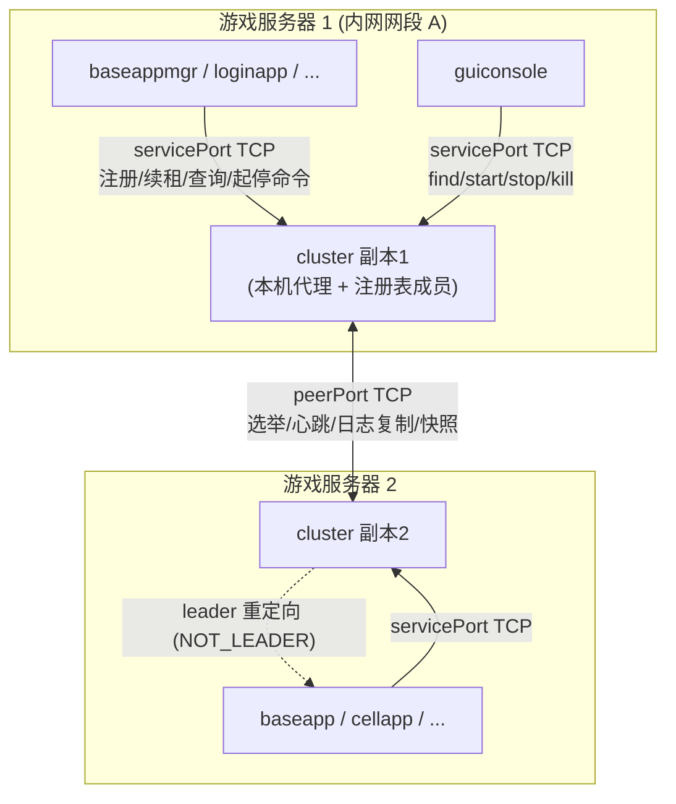

# KBEngine cluster 集群组件 —— 整体架构梳理与设计/技术细节

> 分支/基线：`BigWorld2.0`（commit `cdd715b`，"cluster-based service discovery (replaces machine) + AI verification docs"）
> 状态：**已实现并验证**（2026-09，设计、编码、双平台构建、集成测试、静态自检均已完成）
> 本文件定位：**入口级梳理文档**，自包含地给出 cluster 的设计架构与技术细节要点；
> 更细的实现级说明以 **`docs/kbe_cluster_technical.md`（与源码逐行对齐，唯一实现权威）** 为准，
> 演进历史与取舍动机见 **`docs/kbe_cluster_design.md`**。三份文档配套阅读。

---

## 目录

1. [一句话定位](#1-一句话定位)
2. [背景：为什么替换 machine](#2-背景为什么替换-machine)
3. [总体架构](#3-总体架构)
4. [进程与模块划分](#4-进程与模块划分)
5. [线程模型](#5-线程模型)
6. [一致性核心：极简 Raft 子集](#6-一致性核心极简-raft-子集)
7. [注册表状态机](#7-注册表状态机)
8. [服务面协议 cluster_interface](#8-服务面协议-cluster_interface)
9. [副本间协议 PeerProto](#9-副本间协议-peerproto)
10. [远程起停与本机代理](#10-远程起停与本机代理)
11. [组件侧引导与 ID 分配改造](#11-组件侧引导与-id-分配改造)
12. [配置项与端口](#12-配置项与端口)
13. [快照与持久化](#13-快照与持久化)
14. [关键数据结构](#14-关键数据结构)
15. [构建工程与部署清单](#15-构建工程与部署清单)
16. [实施状态与验证结果](#16-实施状态与验证结果)
17. [已知限制与明确取舍](#17-已知限制与明确取舍)
18. [代码/文档导航](#18-代码文档导航)

---

## 1. 一句话定位

`cluster` 是 KBEngine 引擎内**自研的高可用集群组件**（无 etcd/Consul/ZooKeeper 等外部依赖），
在 `BigWorld2.0` 分支中**完全取代原 `kbe_Machine` 进程**，为全部服务组件提供：

- 组件**注册 / 发现 / 启动引导**（find）；
- 组件**存活判定**（TTL 租约，替代 machine 的"本机进程表"）；
- guiconsole 的**远程起停** `startserver / stopserver / killserver`（本机代理执行）。

对外为 TCP 直连（弃用 UDP 广播），内部为多副本选主（极简 Raft 子集）的一致性子系统。

---

## 2. 背景：为什么替换 machine

原 KBEngine 依赖**每物理机一个 `kbe_Machine` + 局域网 UDP 广播/单播**完成服务注册与发现：

| 原机制 | 弱点 |
|---|---|
| UDP 广播组网 | 跨网段/跨机房困难；路由器屏蔽广播即不可用 |
| 无持久化 / 无强一致 | machine 重启丢全局注册表；发现依赖"谁先应答" |
| 本机进程表判定存活 | 机器崩溃/网络分区时无法及时判定远端组件下线 |
| 无线性一致 API | 外部系统/控制台无权威全局视图 |

### 2.1 明确的目标（用户已确认）

1. **引擎内自研** cluster（多副本 + 选主/同步），不引入外部一致性依赖；
2. cluster **完全替代** `kbe_Machine`（老进程/老协议/老代码删除）；
3. 承接：注册/发现/引导查询 + 远程起停 `start/stop/kill`；
4. 明确不承接：
   - 中央 ID 分配（`queryComponentID`）→ 改为本地确定性生成 + 注册冲突检测；
   - 机器资源/负载监控（`queryLoad/onQueryMachines/lookApp`）→ guiconsole 相应视图失效（记录为已知局限）；
5. 交付：设计文档 + 本仓库源码改造（Linux Makefile 与 Windows vcxproj/sln 双平台）+ 示例配置 + 启动冒烟/故障演练。

---

## 3. 总体架构



要点：

- **组件/工具 → cluster**：统一 TCP 入口为任意副本的 `servicePort`。组件从 `<cluster><addresses>` 获得成员 IP 列表依次尝试；非 leader 副本在响应中回 `MSG_RESP_NOT_LEADER(leaderIP, leaderPort)`，客户端据此重连 leader。
- **副本之间**：走 `peerPort` TCP，实现极简 Raft 子集（选举 + 心跳 + 日志复制 + majority 提交 + 快照）。
- **本机代理**：每个副本同时是"本机代理"。`start/stop/kill` 的目标组件若在本副本所在主机，则由该副本本机拉起/杀停进程；否则 leader 按注册表把指令**转发**给目标主机副本（`MSG_PROXY_*`），结果回报 leader → 请求方。
- **部署形态**：每台部署 cluster 副本的机器一个进程。成员数建议 ≥3（多数派容错），最少 1（单成员模式 = 无容错的"高可用注册中心"，用于单机开发/演示）。

### 3.1 端口规划

| 名称 | 默认值 | 常量/配置位置 | 说明 |
|---|---|---|---|
| servicePort | 20093 | `ENGINE_COMPONENT_INFO::clusterServicePort`；XML `<cluster><servicePort>` | 组件/工具连接的服务 TCP 端口 |
| peerPort | 20094 | `ENGINE_COMPONENT_INFO::clusterPeerPort`；XML `<cluster><peerPort>` | 副本间一致性通信端口 |
| （已删）machine 遗留 | 20086/20087/20088 | `network/common.h` | machine 相关广播/发现宏已随 machine 删除 |

> 20093/20094 落在 `KBE_PORT_START(20000)+93/+94`，不与历史引擎常量冲突；端口均可在 XML 覆盖。

---

## 4. 进程与模块划分

源码目录：`kbe/src/server/cluster/`，新增进程工程仿原 `machine` 工程结构。

| 文件 | 模块/职责 |
|---|---|
| `cluster.h/.cpp` | `class Cluster : public ServerApp, public Singleton<Cluster>`，进程骨架与生命周期 |
| `cluster_interface.h` | **服务面协议**：消息类型/数据结构/序列化（纯头文件、自包含、不依赖 lib/network） |
| `cluster_core.h/.cpp` | **一致性核心**：极简 Raft（选举/心跳/日志复制/提交/快照）+ 注册表内存状态机 + 双端口 TCP 监听 + 指令路由与聚合 |
| `cluster_process.h/.cpp` | **本机代理执行器**：Linux fork+exec / Windows CreateProcess；SIGINT / taskkill；SIGKILL / taskkill /f |
| `main.cpp` | `kbeMainT<Cluster>(..., CLUSTER_TYPE, ...)` 入口；通过 `#undef/#define DEFINE_IN_INTERFACE` 注册各组件 interface 进引擎消息 digest |
| `imp_stubs.cpp` | 引擎消息存根 |
| `Makefile` / `cluster.vcxproj` / `.filters` | Linux / Windows 构建工程 |
| `test/` | 集成测试工程（`test_client.cpp/dummy_proc.cpp/snapshot_gen.cpp`、`run_tests.ps1`、`TESTCASES.md`） |
| `smoke/` | 早期冒烟资产（测试工程演进为 `test/` 后保留历史） |

组件类型扩展（已完成，旧编号不变）：

```
CLUSTER_TYPE = 15, COMPONENT_END_TYPE = 16
COMPONENT_NAME[16] / COMPONENT_NAME_1 / COMPONENT_NAME_2 尾部追加 "cluster"
```

---

## 5. 线程模型

进程主线程跑引擎 `EventDispatcher`（ServerApp 主循环），**一致性状态机保持单线程语义**：

| 线程 | 职责 |
|---|---|
| `serviceAcceptorLoop` | accept `servicePort`，每连接派生 `serviceConnThread` |
| `serviceConnThread(ep, connId)` | 读一条帧 → 入队 `EVENT_SERVICE_REQ` → 等待主循环应答（上限 **4000ms**）→ 回帧 → 关闭。**短连接模型：一次请求一条连接** |
| `peerAcceptorLoop` | accept `peerPort`；按对端源 IP 匹配成员序号（非成员关闭）；重复连接关闭 |
| `peerConnectorLoop` | 主动连接"成员序号大于自己"的对端（序号小者主动），约 1s 重试 |
| `peerConnThread(ep, peerIdx)` | 持续读对端帧 → 入队 `EVENT_PEER_MSG`；断开清 `connected` 并置 `needSnapshot` |

- 所有"读写状态机"操作封装为事件/命令投递到主循环队列（互斥锁保护）；
- 主循环 `tick()`（100ms 游戏帧）批量消费队列并推进 Raft/注册表/TTL/快照；
- 角色机、日志、注册表、计时器**只在主循环访问**，无额外锁。

`tick()` 每帧处理顺序：`drainEvents()` →（非 leader）选举超时检查 →（leader）心跳/复制 → leader TTL 扫描（≥1s）→ 定期快照/日志归档。

---

## 6. 一致性核心：极简 Raft 子集

`class ClusterCore`（`cluster_core.h/.cpp`）。满足"低频、小数据、高可用"注册表场景。

### 6.1 状态与角色

```
Role: FOLLOWER=0 / CANDIDATE / LEADER
持久状态: currentTerm_, votedFor_, log[]
易失状态: commitIndex_, lastApplied_, leaderIdx_
归档状态: snapshotIndex_, snapshotTerm_
日志项:   RaftLogEntry { index(从1), term, type, data }
```

- 成员表：XML `<addresses>` 顺序决定成员序号 `0..N-1`；启动校验本机在表内，`<addresses>` 空 → 单成员自举。
- 计时：选举超时默认 3000ms，实际 `[T, T+2T/3)` 随机抖动；心跳 1000ms。

### 6.2 选举

- follower 超时未收心跳 → `term+1` → candidate → 广播 `PM_VOTE_REQ(term, selfIdx, lastIdx, lastTerm)`；
- 投票条件：term 不旧 + 未投票给他人 + 候选日志不旧于本机；`votedFor` 保证一 term 一票；
- 得票 ≥ `majority = N/2 + 1`（含自己）→ leader，立即广播 `AppendEntries` 确立权威；
- 启动留 500ms 心跳窗口再进入选举，防刚启动即选主抖动。

### 6.3 心跳与日志复制

- leader 每心跳间隔向所有成员发 `PM_APPEND`（kind=0 增量日志 / kind=1 快照）；
- `prevIndex/prevTerm` 校验不匹配 → 回 ack=0 → leader 置 `needSnapshot` 下轮全量快照追平；
- 同 index 不同 term → follower 截断尾部再追加（日志冲突以 leader 为准）；
- 空洞保护；`leaderCommit` 驱动 follower `applyCommitted()`。

### 6.4 提交与 apply

- `advanceCommit()`（leader）：对每个候选 index，统计"自己 + connected 且 lastAcked≥idx 的对端" ≥ majority 即推进 `commitIndex_`，并完成等待该日志的客户端连接（`cmdWaiter_[idx]` → 应答 OK）；
- 写命令统一走 `appendLog(type,payload)`：追加日志 → 立即复制 → 立即 `advanceCommit()`（单成员即刻提交）。

### 6.5 读一致性

- **读写均走 leader、线性一致**（未实现 lease-read）：`FIND/QUERY_ALL` 由 leader 在 `commitIndex` 之后的状态机上执行并应答；follower 一律回 `MSG_RESP_NOT_LEADER`，不本地服务。

### 6.6 分区与脑裂防护

- 一个 term 一个 leader；失去 majority 的副本无法提交（客户端挂起超时重试）；
- 分区内副本不做权威服务（含读），term 高的一侧恢复后收敛；重连对端置 `needSnapshot` → 快照 + 增量日志追平。

---

## 7. 注册表状态机

纯内存，命令（写日志）与语义：

| Command | 语义 |
|---|---|
| `CMD_REGISTER=1` | `(uid,type,cid)` key 不存在则新增；同 key 同 pid 视为续租更新全量字段；**不同 pid 的活跃占用 → 冲突拒绝**（`MSG_RESP_IDENTITY_CONFLICT`） |
| `CMD_RENEW=2` | 更新 `lastRenewal`；不存在忽略 |
| `CMD_UNREGISTER=3` | 优雅下线：删除 entry |
| `CMD_EXPIRE=4` | TTL 扫描到期：删除 entry（**也走日志复制**，保证各副本一致） |

- key = `encodeKey(uid:int32, type:int32, cid:uint64)`（16 字节）；规模小（几十~几百条），查询为线性扫描，无二级索引；
- 查询：`Find(type, cid=0)` 返回该类型全部 Entry；`Find(type, cid)` 精确寻址；`QueryAll` 返回 uid 下全部组件；
- 冲突判定：旧 entry 未过期（`now-lastRenewal < lease`）且 pid 不同 → 拒绝；同 pid / 已过期残留 → 允许覆盖。

### TTL 租约（替代原"本机进程表"存活判定）

- 注册成功即获得租约（`componentLeaseSeconds` 默认 15s）；
- 组件每 `componentHeartbeatInterval`（默认 5s）向 leader 发 `MSG_RENEW`（本身是复制日志）；
- leader 每秒 `ttlScan()` 生成 `CMD_EXPIRE` 日志驱逐过期条目；
- 优雅退出直接发 `MSG_UNREGISTER`，不等 TTL。

---

## 8. 服务面协议 cluster_interface

`kbe/src/server/cluster/cluster_interface.h`（纯头文件），服务端 / 组件侧（`components.cpp`）/ guiconsole（`tools/guiconsole/ClusterClient`）三方共用。

### 8.1 帧格式与连接模型

```
请求/响应帧: [u32 length(BE)] [u8 type] [payload]
```

- 一次交互一条短连接（连接 → 一条帧 → 一条应答帧 → 关闭）；
- 字节序网络序（大端）；字符串 = `u32 长度前缀 + UTF-8 字节`；
- 服务连接线程等待应答上限 4000ms；组件侧每次 `clusterRoundTrip` 超时 600/400/800ms（按调用指定）；
- 版本：`PROTOCOL_VERSION = 1`，作为 `encodeComponentData/encodeServerCommand` 的首字节，解码时校验。

### 8.2 消息总表

| 类型 | 值 | 方向 | 载荷/响应 |
|---|---|---|---|
| `MSG_QUERY_LEADER` | 0x01 | →任意副本 | 无载荷；`LEADER`/`NOT_LEADER` |
| `MSG_REGISTER` | 0x02 | →leader | `encodeComponentData`；OK/冲突/重定向 |
| `MSG_RENEW` | 0x03 | →leader | uid(type)i32, cid u64, pid u32；OK/NotFound/重定向 |
| `MSG_UNREGISTER` | 0x04 | →leader | uid, type, cid；OK |
| `MSG_FIND` | 0x05 | →leader | uid, findType, findCid；ENTRY/ENTRY_LIST/NotFound |
| `MSG_QUERY_ALL` | 0x06 | →leader | uid；ENTRY_LIST（guiconsole 组件树） |
| `MSG_START_SERVER` | 0x07 | →leader | `encodeServerCommand`；CMD_RESULT |
| `MSG_STOP_SERVER` | 0x08 | →leader | 同上 |
| `MSG_KILL_SERVER` | 0x09 | →leader | 同上 |
| `MSG_PROXY_START_SERVER` | 0x0A | leader→目标副本 | 本机代理指令；**副本不校验角色、不重定向** |
| `MSG_PROXY_STOP_SERVER` | 0x0B | leader→目标副本 | 同上 |
| `MSG_PROXY_KILL_SERVER` | 0x0C | leader→目标副本 | 同上 |
| `MSG_RESP_LEADER` | 0x81 | 副本→客户端 | u32 leaderIP, u16 leaderServicePort |
| `MSG_RESP_NOT_LEADER` | 0x82 | 副本→客户端 | 同上（未知 leader 时全 0） |
| `MSG_RESP_OK` | 0x83 | | 无载荷 |
| `MSG_RESP_NOT_FOUND` | 0x84 | | 无载荷 |
| `MSG_RESP_IDENTITY_CONFLICT` | 0x85 | | `encodeComponentData`（已存在进程完整信息） |
| `MSG_RESP_ENTRY` | 0x86 | | `encodeComponentData` |
| `MSG_RESP_ENTRY_LIST` | 0x87 | | u16 count + count×`encodeComponentData` |
| `MSG_RESP_CMD_RESULT` | 0x88 | | i32 code + string message |
| `MSG_RESP_ERROR` | 0x89 | | string message |

### 8.3 ComponentData 字段序（对齐 machine onBroadcastInterface 25 字段）

```
u8 ver(1) | u32 uid | str username | u32 componentType | u64 componentID | u64 componentIDEx
u32 globalOrder | u32 groupOrder | u16 gus | u32 intaddr | u16 intport
u32 extaddr | u16 extport | str extaddrEx | u32 pid | f32 cpu | f32 mem
u32 usedmem | i8 state | u32 machineID | u64 extradata[4]
```

### 8.4 ServerCommandData 字段序

```
u8 ver(1) | u32 uid | str username | u32 componentType | u64 cid(0=按类型解析)
u16 gus | str targetHost | str rootPath(KBE_ROOT) | str resPath | str binPath
```

> 与 machine 时代 start/stop/kill 的字段语义**级兼容**，guiconsole 迁移成本最小。

### 8.5 服务请求处理流程

1. 取首字节 `mt`；
2. `MSG_QUERY_LEADER` → 直接应答 `LEADER/NOT_LEADER`（不需要 leader）；
3. `MSG_PROXY_*` → 映射回 `MSG_START/STOP/KILL`，`handleCtlCommand(localOnly=true)`；
4. 其余消息非 leader → 统一 `MSG_RESP_NOT_LEADER`；
5. 写命令（注册/续租/注销）→ `appendLog + registerWaiter`：客户端连接挂起等 majority 提交，成功由 `advanceCommit` 应答 OK，超 4s 无应答被断开。

---

## 9. 副本间协议 PeerProto

定义于 `cluster_core.cpp`（不导出）。成员间**长连接**、双向持续读写。

| MsgType | 值 | 说明 |
|---|---|---|
| `PM_VOTE_REQ` | 0x01 | term/candidateIdx/candLastIdx/candLastTerm |
| `PM_VOTE_RESP` | 0x02 | term/granted |
| `PM_APPEND` | 0x03 | kind=0 增量日志（prevIndex/prevTerm/count+items）；kind=1 快照（snapLen+bytes） |
| `PM_APPEND_RESP` | 0x04 | term/ack/index |

帧 = `[u32 length(BE)][u8 type][...]`；单帧上限 `FRAME_MAX = 1MB`，异常长度直接断开。

链路管理要点：

- **主动连接规则：成员序号小者连序号大者**（避免对连）；出站连接显式 bind 到本机 selfIP，避免多网卡下源地址错乱导致识别错成员/链路抖动；
- peer 连接按**源 IP** 匹配成员序号，非成员接入即断；
- 断开 → 清 `connected` 置 `needSnapshot`（重连后全量快照追平）。

---

## 10. 远程起停与本机代理

### 10.1 调用链

```
guiconsole / 组件 → 任意副本 servicePort
  → QueryLeader 收敛到 leader
  → leader 依注册表 + targetHost 聚合目标主机
       ├─ 本机：ClusterProcess::start/stop/killProcess
       └─ 其它主机：短连接转发 MSG_PROXY_*（start 3000ms / stop-kill 4000ms 超时）
  → 聚合结果以 MSG_RESP_CMD_RESULT(code, message) 返回
```

- `handleCtlCommand(ev, op, off, localOnly=false)`：leader 处理 MSG_START/STOP/KILL；
  `localOnly=true` 时（副本收到 `MSG_PROXY_*`）不校验角色、不重定向、只在本机执行并直接应答，避免循环转发。
- 类型合法性校验：仅允许 `type ∈ (UNKNOWN, COMPONENT_END_TYPE)` 的真服务组件，排除 CLIENT/MACHINE/CONSOLE/TOOL/CLUSTER。
- 幂等：无匹配运行实例 → `code=0 "no running X component found (nothing to do)"`。

### 10.2 ClusterProcess 执行器语义（对齐原 machine）

| 操作 | Linux | Windows |
|---|---|---|
| start | fork+exec；`KBE_ROOT/KBE_RES_PATH/KBE_BIN_PATH` 取父进程环境；argv=`[bin, --cid=, --gus=]`；CLOEXEC 管道探测 exec 成败（select 上限 ~1s） | CreateProcessW + `CREATE_NEW_CONSOLE` |
| stop | `kill(pid, SIGINT)`（引擎 ServerApp 将 SIGINT 注册为优雅退出，等价原 reqCloseServer） | `taskkill /t /pid N`（不带 /f） |
| kill | `SIGKILL` + 轮询消失（≤15 次，每次至多 10×100ms，窗口 ~1.5s） | `taskkill /f /t` + 轮询 |

---

## 11. 组件侧引导与 ID 分配改造

### 11.1 组件侧客户端（`lib/server/components.cpp`）

- `clusterRequest(msg, resp, timeoutMS)`：读 `<cluster>` 的 servicePort + addresses（空回退 127.0.0.1）→ 逐地址短连接 `clusterRoundTrip`（connect 需 `htons`，非阻塞 + select）→ 每地址最多跟随 4 次 `MSG_RESP_NOT_LEADER` 重定向（leaderIP=0 时返回 -1 让上层重试）；
- 组件不注册/发现 machine/cluster 组件自身；
- 注册状态机：未注册时每 500ms 尝试 `MSG_REGISTER`，收到 OK 才允许发现；冲突/集群不可达均按既定语义处理（冲突时若冲突体 `machineID==本机 macMD5` 且 pid 已不存在 → 等待租约过期自动重试，否则视为身份非法退出）；
- 发现：每秒尝试 find 目标组件（`MSG_FIND`），成功后进入运行态；**续租独立于发现进度**，每 `componentHeartbeatInterval` 秒 `MSG_RENEW`；收到 `MSG_RESP_NOT_FOUND` → 自身注册丢失，回到未注册态重新注册（leader 切换/快照恢复自愈）；
- 优雅退出：`Components::finalise()` 发 `MSG_UNREGISTER`（800ms 超时，不需应答）。

### 11.2 组件 ID 确定性生成（`kbemain.h::checkComponentID`，已完成改造）

```
if (g_componentID == -1):           // 未显式 --cid
    macMD5 = getMacMD5()
    g_componentID = uid*COMPONENT_ID_MULTIPLE + macMD5*10000 + componentType*100 + 1
```

- 多开同机同类型：靠 `--cid` / `--gus` 显式区分；重复身份由 cluster 注册冲突检测兜底；
- `MACHINE_TYPE/CLUSTER_TYPE/LOGGER_TYPE` 同样本地生成；
- 原 `IDComponentQuerier`（UDP 广播依赖 machine）已随 machine 删除。

### 11.3 guiconsole（`tools/guiconsole`）

- 新增 `ClusterClient.{h,cpp}`：与 components 同帧格式的阻塞短连接客户端，自动处理 `MSG_RESP_NOT_LEADER` 重定向，支持 `sendServerCommand(start/stop/kill)`、`queryAllComponents(uid,...)`（`MSG_QUERY_ALL` 填充组件树）；
- `StartServerWindow.cpp`：start/stop 改为对布局主机 ip:servicePort 发 `MSG_START/STOP_SERVER`（`targetHost=该主机ip`）；结果按 `CMD_RESULT` code 更新布局 running 列；
- `guiconsoleDlg.cpp::OnToolBar_StopServer`：不再 UDP 广播，改为对 `layouts.xml` 部署主机发 `MSG_STOP_SERVER`（无布局回退 127.0.0.1）；
- `ConnectRemoteMachineWindow.cpp`：默认端口 20099 → 20093，连接成功后直接 `MSG_QUERY_ALL`。

---

## 12. 配置项与端口

配置段 `<cluster>`，解析在 `lib/server/serverconfig.cpp`（`readClusterConfig`），默认值见 `kbe/res/server/kbengine_defaults.xml`；组件侧经 `ServerConfig::getKCluster()`（`serverconfig.inl`）读取。

| XML 项 | ENGINE_COMPONENT_INFO 字段 | 默认 | 说明 |
|---|---|---|---|
| `internalInterface` | `internalInterface` | 空 | 绑定网卡/IP，空自动选择 |
| `servicePort` | `clusterServicePort` | 20093 | 服务面 TCP |
| `peerPort` | `clusterPeerPort` | 20094 | 副本间 TCP |
| `addresses/item...` | `cluster_addresses`（vector<string>） | 空 | 成员 IP 表，顺序=成员序号；空=单成员自举 |
| `electionTimeout` | `clusterElectionTimeoutMS` | 3000 | 选举超时 ms（实际加 [0,2/3·T) 抖动） |
| `heartbeatInterval` | `clusterHeartbeatIntervalMS` | 1000 | leader 心跳间隔 ms |
| `componentHeartbeatInterval` | `clusterComponentHeartbeatInterval` | 5 | 组件续租间隔 秒 |
| `componentLeaseSeconds` | `clusterComponentLeaseSeconds` | 15 | 组件租约时长 秒 |
| `SOMAXCONN` | `tcp_SOMAXCONN` | 引擎默认 | 监听 backlog |

> 约定：所有副本的 servicePort/peerPort/addresses 必须一致；每台机器只跑一个副本。
> 测试加速参数（`cluster/test/assets/*`）：electionTimeout=1200、heartbeatInterval=400、componentHeartbeatInterval=2、componentLeaseSeconds=6，成员表 `[127.0.0.1,127.0.0.2,127.0.0.3]` 单机多副本演练。

三副本示例（每台机器相同配置）：

```xml
<root>
	<cluster>
		<addresses>
			<item> 192.168.10.11 </item>
			<item> 192.168.10.12 </item>
			<item> 192.168.10.13 </item>
		</addresses>
	</cluster>
</root>
```

---

## 13. 快照与持久化

- **文件名**：`cluster_state_<selfIdx_>.bin`（副本工作目录）；
- **磁盘格式**：`[u32 magic = 0x4B42E533][registrySnapshotBytes]`；
- **registrySnapshotBytes 布局**：`u64 snapshotIndex | u64 snapshotTerm | u64 commitIndex | u64 currentTerm | u32 count`，随后 count 条 `str key | str encodeComponentData | u64 lastRenewal`；
- **触发**：每 tick 检查 `距上次 ≥60s && log>64 && commitIndex>snapshotIndex` → 落盘后截断日志；
- **新副本/落后副本追平**：leader 判 `needSnapshot / lastAcked<snapshotIndex` → 发全量快照（无 magic），follower 解码 → 本地落盘 → 整体替换 registry/log；
- 启动时 `loadSnapshotFromDisk()` 校验 magic 恢复。

---

## 14. 关键数据结构

```cpp
// 日志(复制)项
struct RaftLogEntry { uint64 index; uint64 term; uint8 type; std::string data; };

// 注册表条目
struct RegistryEntry { ClusterInterface::ComponentData data; uint64 lastRenewal; };

// 事件(网络线程投递 → 主循环消费)
struct Event { uint8_t type; uint64 connId; int peerIdx; std::string data; };
// EventType: EVENT_SERVICE_REQ=1, EVENT_PEER_MSG=2
// CmdType:   CMD_REGISTER=1, CMD_RENEW=2, CMD_UNREGISTER=3, CMD_EXPIRE=4

// 对端状态
struct PeerCtx { bool connected; bool outbound; Network::EndPoint* ep;
                 uint64 lastAcked; bool needSnapshot; };
```

- 并发保护：事件队列/对端状态/应答表各自互斥锁；Raft 状态机数据仅主循环访问；
- `cmdWaiter_`(日志index→connId) 与 `revWaiter_`(connId→日志index) 用于写命令提交后应答；
- `replies_`(connId→响应字节) + `replyCv_` 供 service 连接线程等待主循环应答。

---

## 15. 构建工程与部署清单

### 15.1 工程变更（已完成）

| 动作 | 落点 |
|---|---|
| 新增 cluster 进程工程 | `kbe/src/server/cluster/`（Makefile + cluster.vcxproj/.filters） |
| server Makefile | `kbe/src/server/Makefile`：含 cluster、**不含 machine** |
| Windows 解决方案 | `kbe/src/kbengine.sln`：含 cluster.vcxproj、**移除 machine.vcxproj** |
| 类型/组件名 | `lib/common/common.h`：CLUSTER_TYPE=15/COMPONENT_END_TYPE=16、名称表尾部 "cluster" |
| 组件 ID 生成 | `lib/server/kbemain.h::checkComponentID`（本地确定性 + 冲突兜底） |
| 组件引导 | `lib/server/components.{h,cpp}` → cluster TCP 客户端 |
| 工具 | `kbe/src/server/tools/guiconsole/*` → ClusterClient（起停/查询走 cluster） |
| 清理（已执行） | `server/machine/`、`lib/server/id_component_querier.*`、`lib/network/bundle_broadcast.*` 物理删除；`network/common.h` 中 machine 广播宏删除 |
| 各组件 main.cpp | 移除 `machine/machine_interface.h` 的 `DEFINE_IN_INTERFACE` include 对 |

### 15.2 构建方式

- Linux：`cd kbe/src && make`；
- Windows：VS 打开 `kbe/src/kbengine.sln`（Release/x64），或命令行
  `MSBuild cluster.vcxproj /p:Configuration=Release /p:Platform=x64 /p:PlatformToolset=v143` → 产出 `bin/server/cluster.exe`。

### 15.3 启动顺序

`cluster` 最先启动（至少 majority 可用）→ 其它组件。组件找不到 cluster 时按原语义持续重试等待（不 panic）。

### 15.4 冒烟步骤（单机单副本）

1. 启动 cluster，预期日志：`ClusterCore::start(): single-member mode, acting as leader.`；
2. 依次启动 dbmgr/baseappmgr/loginapp/baseapp/cellapp 等，组件注册成功后每 5s 续租；guiconsole 连 127.0.0.1:20093 → 组件树列出各类型；
3. kill 某组件 → ≤15s 内 leader 依租约超时移除，guiconsole 树同步消失。

---

## 16. 实施状态与验证结果

### 16.1 实施进度（已全部落地）

- [x] 任务 1-2：类型 + `<cluster>` 配置段 + 工程注册（Makefile/sln/vcxproj）；
- [x] 任务 3：`cluster_core` 选举/心跳/日志复制/注册表状态机/TTL/快照；
- [x] 任务 4：`components.cpp` + `kbemain.h` 直连 cluster（注册/续租/注销/find/本地 cid）；
- [x] 任务 5/5b：本机代理执行器（cluster_process）+ leader 指令路由/代理转发 + guiconsole 调用链迁移；
- [x] 任务 6：remove-machine（构建、工程、代码、广播宏、物理删除）；
- [x] 任务 7：示例配置 + 冒烟 + 集成测试自动化。

### 16.2 验证结果（2026-09）

| 套件 | 结果 |
|---|---|
| `kbe/src/server/cluster/test/run_smoke.ps1` | 14/14 PASS（启动选主、注册/续租/查询、TTL、leader 故障切换、旧 leader 重入） |
| `run_tests.ps1` | 默认 40/40、`-Fast` 36/36、`-Full` 46/46 PASS（单成员应答、快照加载、3 副本一致性与故障切换、ctl 起停/杀、多数派丢失阻塞恢复） |
| `docs/cluster_static_check.ps1`（无编译静态自检） | 全项 PASS（XML well-formed、默认参数、类型/名称表、端口常量、双平台工程清单、构建内 machine/广播残留检查、废弃文件删除状态） |
| Windows 实编译 | VS2022 v143 编译产出 `bin/server/cluster.exe` 并通过上述套件 |

> 测试发现的缺陷均已修复并记录于 `cluster/test/TESTCASES.md` §7：快照解码 4 字节偏移、单成员写应答漏回、选举抖动常量种子致多副本活锁。

### 16.3 回归检查项

- `kbe_Machine` 二进制/工程/启动项不存在，无 20099 UDP 广播；
- guiconsole 不再发 `onFindInterfaceAddr/onBroadcastInterface`，组件树来自 `MSG_QUERY_ALL`。

---

## 17. 已知限制与明确取舍

1. **成员变更需停机**：无 joint consensus 动态增删；改 `<addresses>` + 重启全部副本；
2. **读也走 leader**：未实现 lease-read；follower 对 FIND/QUERY_ALL 一律重定向；
3. **机器负载/资源监控不承接**：machine 的 `queryLoad/onQueryMachines/lookApp` 相关 guiconsole 视图失效（API 缺口已记录）；
4. **注册信息为内存 + 定期快照**：极端全部副本丢失且快照过期会丢部分已提交注册记录；组件侧靠"续租 NOT_FOUND → 重新注册"自愈；
5. **组件引导超时语义保持原样**：cluster 未就绪时组件持续重试、不 panic；
6. **单成员模式**无容错、无故障切换（`<addresses>` 空即单成员自举 leader），适合单机开发；
7. 以下 machine 残留仅保留作解析/枚举兼容（不构成编译依赖、永不生效）：`MACHINE_TYPE` 枚举与名称、serverconfig `<machine>` 解析、`components.cpp::updateComponentInfos` 死代码、`kbengine_defaults.xml` 中 `<machine>` 默认段。

---

## 18. 代码/文档导航

### 18.1 引擎侧源码

| 路径 | 内容 |
|---|---|
| `kbe/src/server/cluster/` | cluster 进程全部实现 + 集成测试工程 |
| `kbe/src/server/cluster/cluster_interface.h` | 服务面协议（权威定义，含消息表/序列化） |
| `kbe/src/lib/server/components.cpp` | 组件侧 cluster 客户端（注册/续租/find/注销） |
| `kbe/src/lib/server/kbemain.h` | `checkComponentID` 本地确定性 ID 生成 |
| `kbe/src/lib/server/serverconfig.{h,inl,cpp}` | `<cluster>` 配置解析与访问 |
| `kbe/src/server/tools/guiconsole/ClusterClient.{h,cpp}` | guiconsole 短连接客户端 |
| `kbe/src/lib/common/common.h` | CLUSTER_TYPE/COMPONENT_END_TYPE/名称表 |

### 18.2 文档

| 文档 | 定位 |
|---|---|
| **本文档** `docs/kbe_cluster_overview.md` | 整体梳理入口：架构 + 技术要点总览 |
| `docs/kbe_cluster_technical.md` | **实现级唯一权威**：与 `kbe/src/server/cluster/` 逐行对齐 |
| `docs/kbe_cluster_design.md` | 设计文档：背景/目标/取舍/迁移历史/实施状态 |
| `docs/cluster_static_check.ps1` | 无编译静态自检脚本 |
| `kbe/src/server/cluster/test/TESTCASES.md` | 集成测试用例与回归缺陷记录 |
