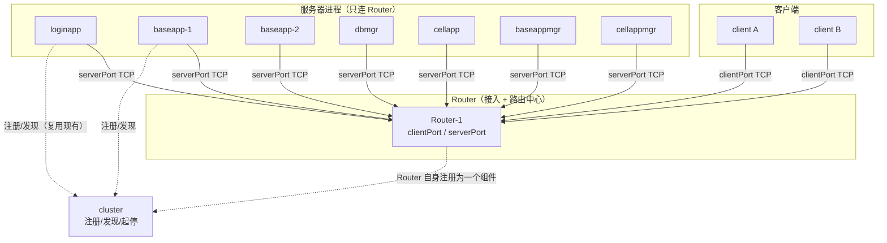
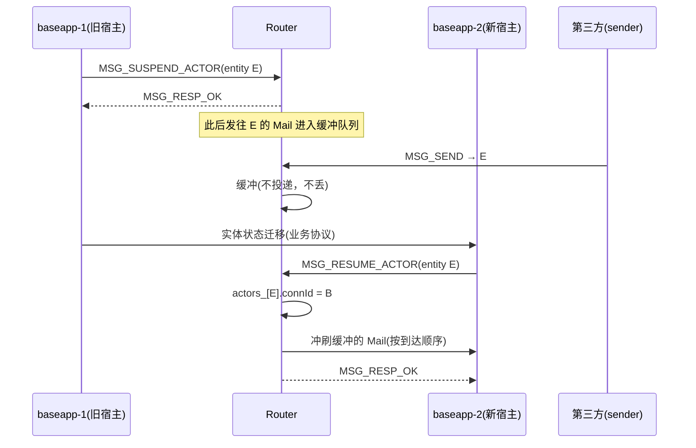

# KBEngine Router + Actor/MailBox + Service 设计文档

> 状态：设计中（随实现更新）
> 适用范围：本仓库 `kbe/` 引擎源码 + `balls_server_assets` demo 工程
> 相关代号：router（路由/接入中心组件）、Actor（通信主体）、MailBox（Actor 通信地址）、
> Service（业务服务，如 FriendService/TeamService）、CallService（服务调用接口）
> 关联文档：`docs/kbe_cluster_design.md`（cluster 集群组件，负责注册/发现/起停）

---

## 1. 背景与目标

### 1.1 现状问题

原 KBEngine 各组件 **点对点两两直连**（`loginapp`↔`baseapp`↔`cellapp`↔`dbmgr`↔`baseappmgr`…），
连接建立依赖 `Components`（注册表）逐类型 `connectComponent` 找地址。由此产生：

| 问题 | 说明 |
|---|---|
| **N×N 连接** | 组件数为 N 时，理论连接数 O(N²)；每个组件都要维护一堆 Channel |
| **客户端直连业务进程** | 客户端连 `loginapp` 登录后被“交给” `baseapp`（`loginapp` 返回 baseapp 外网地址，客户端重连），baseapp 直接面对海量客户端 |
| **Entity 通信与进程绑定** | `EntityCall` / `EntityMailbox` 里直接编码了“目标实体所在组件”，实体在 `baseapp`/`cellapp` 间迁移时，转发逻辑散落在 `baseapp`、`cellapp`、`EntityRemoteMethod`、`ForwardComponent_MessageBuffer` 等多处 |
| **无服务抽象** | 没有“服务”这个概念，`FriendService`/`TeamService` 只能靠约定：先 `findComponent(BASEAPP_TYPE, …)` 再手写消息 |
| **转发语义隐式** | “有缓冲则压队、无缓冲则立即发”“client→cell 需经 baseapp 中转”等语义散落在 handler 中，无法统一治理 |

### 1.2 目标（用户已确认的决策）

1. **抽出 Router 组件**：网络连接部分从各业务进程中剥离。
   - **客户端只连 Router**；
   - **服务器各进程只连 Router**；
   - 进程之间、实体之间的通信全部经 Router 转发。
2. **通信统一为 Actor 模型**：每个通信主体是一个 Actor，持有一个 **MailBox**，
   一切跨进程通信都表现为 **向目标 MailBox 投递 Mail**。
3. **服务化调用**：`FriendService`、`TeamService` 等以 Service 形式注册到 Router，
   调用方通过 **`CallService`** 接口通信，不关心对方进程/实体在哪。
4. **投递语义从简**（重要取舍）：Router **不做可靠性**。
   > Router 的契约是“**在链路存活期间，按路由表把消息通过 TCP 递到目标**”。
   > 补发、去重、ACK、顺序恢复由**业务侧**自行保证；Router 只负责**回报失败**。
   详见 §8。

### 1.3 非目标（明确不做）

- ❌ Router 不做消息持久化 / 重传 / 去重 / 端到端 ACK（见 §8）。
- ✅ ~~本阶段不改造 `cellapp` 内部的空间/ghost 同步路径~~ **已纳入**：ghost/real 属性同步、
  远程调用、volatile 数据等高频路径已统一收敛到 Router 的 **component Actor**
  （见 §14.2），不再依赖 `Components` 直连通道。
- ❌ 本阶段**不下线**组件间直连 Channel 与旧转发缓冲类：它们仍作为
  `RouterMail::isEnabled()` 关闭时的回退通路（逐字节等价），清理统一放到 P5。
- ❌ 不引入外部消息中间件（Kafka/NATS/Redis 等）。

---

## 2. 总体架构



要点：

- **连接收敛为星型**：所有 peer（客户端 + 服务器进程）只与 Router 建立 **一条 TCP 长连接**，
  连接数从 O(N²) 降为 O(N)。
- **Router 是“TCP 的延伸”**：收到一条 `MSG_SEND` 后，解析目标 MailBox 地址，查路由表，
  把**原始帧原样转发**给目标连接。Router 不解释业务体（body）。
- **Router 无状态**：路由表（`actorId → 连接`）是**可重建的软状态**，
  进程崩溃后由 peer 重连 + 重新注册恢复；不落盘。
- **组件注册/发现仍走 cluster**：Router 不替代 `cluster`。
  `cluster` 负责“进程在哪台机器、起来了没有、怎么起停”；
  `Router` 负责“运行期的消息怎么走”。二者职责正交。

---

## 3. 核心概念

### 3.1 Actor

> **Actor 是通信主体**。任何可以被“发消息”的对象都是一个 Actor。

| Actor 类别 | 说明 | 典型 id 来源 |
|---|---|---|
| `MAILBOX_ENTITY` | 实体（base 实体 / cell 实体） | `ENTITY_ID`（64 位） |
| `MAILBOX_COMPONENT` | 进程/组件（baseapp、cellapp、dbmgr…） | `COMPONENT_ID` |
| `MAILBOX_SERVICE` | 业务服务（FriendService、TeamService…） | Service 名哈希或分配 id |

**约束**：
- Actor 的 id 在**全服范围内唯一**（同一 `kind` 下）。
- Actor **必须绑定到一个连接**（`connId`）——这就是“它在哪个进程里”。
- Actor 的先后端位置**不属于 Actor 的语义**，只属于路由表的实现细节（因此可以迁移）。

### 3.2 MailBox

> **MailBox = Actor 的通信地址**。发消息就是“往这个地址投递”。

```cpp
// router_interface.h
struct MailboxAddress
{
    uint8_t  kind;           // MAILBOX_ENTITY / COMPONENT / SERVICE
    uint32_t componentType;  // 元数据：宿主组件类型（便于观测/路由优化，不做强依赖）
    uint64_t actorId;        // 全局唯一 id
};
```

**MailBox 是“逻辑地址”，不是“网络地址”**。它不包含 IP/端口，因此：
- 实体从 baseapp-1 迁到 baseapp-2，MailBox 不变；
- 只需 Router 更新一次路由表（`actorId → 新 connId`），所有正在路上的消息自动改投新宿主。

这正是替换掉现有 `EntityCall` 里“把目标组件地址焊死”的关键收益。

### 3.3 Mail（信封）

一条跨进程消息 = `MSG_SEND` + 载荷：

```
[dst: MailboxAddress]        // 目标地址（Router 只解析这一段）
[src: MailboxAddress]        // 源地址（接收方据此回复）
[msgId: uint64]              // 业务幂等键（Router 原样透传，不解释）
[body: bytes]                // 业务体（Router 原样透传，不解释）
```

**Router 只读 `dst`**：解析出目标 MailBox → 查表 → 转发**整个载荷**。
这就是“TCP 的延伸”在协议层面的体现。

### 3.4 Service 与 CallService

> **Service 是“无实体、按名字寻址”的 Actor**，用于承载不属于任何实体的业务能力。

| 概念 | 说明 |
|---|---|
| `FriendService` | 好友关系服务，逻辑上单例（或按 uid 分片） |
| `TeamService` | 队伍服务 |
| **注册** | 服务宿主进程启动后向 Router 注册：`(serviceName, MailboxAddress)` |
| **发现** | 调用方 `CallService(serviceName, method, args)` → Router 返回/解析出地址 → 转发 |
| **调用** | 默认**请求-响应**（`ask`），响应天然充当 ACK；超时由调用方处理 |
| **多实例** | 同名服务可注册多个（分片/主备），Router 返回列表，由调用方选择策略 |

`CallService` 建议签名（业务层，非 Router 概念）：

```cpp
// 伪接口：由业务侧 ClientSessionService / EntityService 等持有
class ServiceProxy
{
public:
    // 单向：尽力而为，业务自行决定是否用幂等键+重试
    void call(const std::string& serviceName, const std::string& method, const std::string& args);

    // 请求-响应：带 rpcId，超时返回错误；响应即 ACK
    // 关键业务优先用这个，避免自己造 ACK
    bool ask(const std::string& serviceName, const std::string& method,
             const std::string& args, std::string& resp,
             uint32 timeoutMS = 3000);
};
```

---

## 4. 连接拓扑与进程模型

### 4.1 连接模型

| 连接 | 方向 | 端口 | 说明 |
|---|---|---|---|
| 客户端 → Router | 客户端主动连 | `clientPort`（默认 20095） | 客户端登录前即建立；登录成功后绑定 `proxyId` |
| 服务器进程 → Router | 进程主动连 | `serverPort`（默认 20096） | 所有组件（loginapp/baseapp/cellapp/dbmgr/…）各一条长连接 |
| Router → cluster | Router 主动连 | cluster `servicePort`（20093） | Router 自身作为一个组件注册，便于运维巡查 |

**为什么分两个端口？**
- 客户端与内部进程的**信任级别不同**：可对 `clientPort` 单独做限流、超时、加密（`encryption_filter`）、协议演进，而不影响内部通道；
- 内部通道未来可切换为更激进的优化（如批量组包、压缩）。

### 4.2 Router 集群

第一阶段 **Router 单实例**（与 `cluster` 单成员模式同理），故障时 peer 自动重连并重新注册。

后续（非本阶段）可扩展：
- Router 多实例 + **一致性哈希** 把 `actorId` 分片到固定 Router；
- 或 Router 之间互转发兜底（代价是状态变复杂，与 §8 的“无状态”取舍冲突，需重新评估）。

> 本文档按**单实例 Router** 描述语义；多实例仅作扩展方向记录。

### 4.3 线程模型

沿用 `cluster` 已验证的范式（见 `cluster_core.cpp`）：

| 线程 | 职责 |
|---|---|
| **acceptor 线程 ×2** | `clientPort` / `serverPort` 各一个，`accept()` 后 spawn 每连接线程 |
| **每连接读线程** | 阻塞 `recvFrame`，把收到的帧作为 `Event` 投递到主线程事件队列 |
| **主线程（ServerApp 主循环）** | `tick()` 里 `drainEvents()` → 处理 → 通过 `Connection::sendFrame()` 直接回发 |

**线程安全约定**：
- 路由表、Service 注册表**只被主线程访问**，无需锁；
- `Connection` 的 `ep`/`alive` 由自身 `sendMutex` 保护：
  - 读线程退出时在锁内置 `alive=false` 并关闭 `ep`；
  - 主线程发送时在锁内先查 `alive` 再 `sendAll`，因此不存在“发送到已关闭 socket”的竞态；
- 事件队列由 `queueMutex_` 保护。

---

## 5. 协议（router_interface.h）

自包含的请求/响应二进制协议，**不依赖 `lib/network` 的 MessageHandler digest 机制**
（理由与 `cluster_interface.h` 相同：需要与大量异构 peer 通信，不愿把全部 `*_interface.h` 揉进 Router）。
帧格式与 cluster 保持一致：`u32 长度(网络字节序) + [u8 消息类型][载荷]`。

### 5.1 消息类型

| 消息 | 方向 | 载荷 | 响应 |
|---|---|---|---|
| `MSG_HELLO` | peer → Router | `peerKind(1) uid(4) componentType(4) componentId(8) version(2)` | `MSG_RESP_HELLO_OK(connId)` / `MSG_RESP_ERROR` |
| `MSG_PING` | 任意 | 无 | `MSG_RESP_PONG` |
| `MSG_REGISTER_ACTOR` | 进程 → Router | `MailboxAddress` | `MSG_RESP_OK` / `MSG_RESP_ERROR` |
| `MSG_UNREGISTER_ACTOR` | 进程 → Router | `MailboxAddress` | `MSG_RESP_OK` |
| `MSG_SUSPEND_ACTOR` | 进程 → Router | `MailboxAddress` | `MSG_RESP_OK`（此后投往该 Actor 的 Mail 进入缓冲） |
| `MSG_RESUME_ACTOR` | 新宿主 → Router | `MailboxAddress` | `MSG_RESP_OK`（路由改指本连接 + 冲刷缓冲） |
| `MSG_REGISTER_SERVICE` | 进程 → Router | `serviceName(str) + MailboxAddress` | `MSG_RESP_OK` |
| `MSG_FIND_SERVICE` | 任意 → Router | `serviceName(str)` | `MSG_RESP_SERVICE(地址列表)` / `MSG_RESP_NOT_FOUND` |
| `MSG_SEND` | Actor → Router | `dst + src + msgId + body` | **无同步响应**（失败异步回报） |
| `MSG_RESP_OK` | Router → peer | 无 | — |
| `MSG_RESP_NOT_FOUND` | Router → peer | 无 | — |
| `MSG_RESP_ERROR` | Router → peer | `string message` | — |
| `MSG_DELIVERY_FAILED` | Router → 发送方 | `src + dst + msgId + code(4)` | — |

### 5.2 失败码（`DeliveryResult`）

| 码 | 含义 | 触发点 |
|---|---|---|
| `DELIVERY_OK` | 已投出 | — |
| `DELIVERY_TARGET_NOT_FOUND` | 路由表无此 Actor | `MSG_SEND` 查表失败 |
| `DELIVERY_TARGET_UNREACHABLE` | 目标连接已断开/不可写 | `sendFrame` 失败 |
| `DELIVERY_DROPPED_SUSPENDED` | 目标处于迁移挂起且缓冲溢出 | 缓冲队列超限 |
| `DELIVERY_BAD_REQUEST` | 报文不合法 | 解析失败 |

> **这三类失败回报是 Router 为业务侧可靠性提供的全部支撑**，见 §8。

---

## 6. 路由表与 Actor 生命周期

### 6.1 数据结构（`ActorRegistry`）

| 结构 | 键 | 值 | 说明 |
|---|---|---|---|
| `actors_` | `ActorKey{kind, componentType, actorId}` | `ActorEntry{connId, componentType, ownerName, lastActiveMS}` | Actor → 连接 |
| `services_` | `serviceName` | `std::vector<MailboxAddress>` | 服务名 → 地址列表 |
| `suspended_` | `ActorKey` | `SuspendedActor{oldConnId, buffered}` | 迁移期缓冲（Actor **已注册**） |
| `pending_` | `ActorKey` | `PendingActor{deadlineMS, buffered}` | 目标**未注册**期缓冲（见 §6.4） |

`ActorKey` **必须**包含 `componentType`：同一 `ENTITY_ID` 的 base 部分与 cell 部分是两个 Actor。

全部为**纯内存软状态**，Router 重启后由 peer 重连重新注册填充。

### 6.2 Actor 注册/注销

```
进程启动 → 连 Router → MSG_HELLO(peerKind=COMPONENT)
       → 为每个本地 Actor 发 MSG_REGISTER_ACTOR
       → 注册 Service 时发 MSG_REGISTER_SERVICE
进程退出/实体销毁 → MSG_UNREGISTER_ACTOR（可选，连接断开时 Router 会兜底清理）
连接断开 → Router 删除该 connId 名下所有 actors_ / services_ 条目
```

**断连兜底清理是必须的**：否则路由表会残留指向死连接的条目，
后续 `MSG_SEND` 会得到 `TARGET_UNREACHABLE`（可接受），
但更早的失败是 `TARGET_NOT_FOUND`（目标会重连并重新注册，语义更清晰）。

注册还有一个副作用：**命中 `pending_` 时立即冲刷**（见 §6.4），
因此"先注册再发消息"的组件无需关心顺序，晚到的消息也不会丢。

### 6.3 迁移（SUSPEND / RESUME）

这是 MailBox 相对 `EntityCall` 的核心优势场景：



**语义边界（务必明确）**：
- 缓冲队列**仅存在于 Router 内存**，有上限（`routerActorBufferMax`，默认 512 条）；
- 溢出时丢弃最旧的并回 `MSG_DELIVERY_FAILED(DELIVERY_DROPPED_SUSPENDED)` 给发送方；
- **Router 崩溃 → 缓冲全丢**。这是 §8 取舍的直接后果：需要强一致迁移的业务，
  应在迁移协议里自己做“暂停 → 迁移 → 恢复 → 对账”，而不是依赖 Router 缓冲。
- `RESUME` 未在超时内到达（`routerSuspendTimeoutMS`，默认 30000）→ Router 自动 `RESUME`
  到原连接（回滚），避免永久挂起。

### 6.4 目标未就绪（PENDING）缓冲

覆盖"目标 Actor **尚未注册**"的场景（组件刚启动 / 实体 cell 部分还没创建），
即旧通路 `ForwardComponent_MessageBuffer`、`entity_messages_forward_handler` 的能力：

```
sender --MSG_SEND--> Router: 目标未注册
                     └─> pending_[key].buffered 入队(有界 + TTL)
目标进程 --MSG_REGISTER_ACTOR--> Router
                     └─> takePending(): 按到达顺序投递到新连接
TTL 到期 / 溢出     └─> 丢弃并向各条 Mail 的发送方回 DELIVERY_DROPPED_PENDING
```

- 有界：`<pendingBufferMax>`（默认 512 条），溢出丢弃最旧一条；
- 有时限：`<pendingTimeout>`（默认 30000 ms），到期逐条回报失败；
- 与 `suspended_` 互斥：已注册的 Actor 走 SUSPEND/RESUME，未注册的走 PENDING；
- 两条缓冲都在主线程访问，冲刷保持到达顺序（与 §12.2 的 FIFO 约定一致）。

---

## 7. 服务化调用

### 7.1 与 Actor 的关系

Service **不是新机制**，而是 Actor 的一种 `kind`：

```
CallService("FriendService", "addFriend", args)
  ≈ 构造 MailBox{kind=SERVICE, actorId=hash("FriendService")}
    + MSG_SEND(body = {method, rpcId, args})
```

区别只在**寻址方式**：Actor 用 id 定址，Service 用**名字**定址，
因此 Router 额外维护一张 `services_` 名字表。

### 7.2 调用形态

| 形态 | 实现 | 可靠性 | 适用 |
|---|---|---|---|
| `call`（单向） | `MSG_SEND`，不等响应 | 尽力而为 | 通知类、可丢类 |
| `ask`（请求-响应） | `MSG_SEND` + 业务层按 `rpcId` 等响应 | **响应即 ACK** | 关键业务（默认） |
| `call` + 幂等键 | `MSG_SEND` 带 `msgId`，超时重发同一 `msgId` | 至少一次 | 无法用 ask 的长流程 |

**推荐**：关键服务调用默认 `ask`，把“是否重试”交给业务，Router 不参与。

### 7.3 小结

- Service 让 `FriendService`/`TeamService` 从“先 findComponent 再手写消息”
  变成“按名字调用”，**调用方与宿主进程解耦**；
- 服务可水平扩容：同名多实例注册，Router 返回列表，调用方按 uid 取模/一致性哈希选。

---

## 8. 投递语义与可靠性边界（核心取舍）

> 本节是**用户已拍板的决策**，也是整个 Router 设计的约束前提。

### 8.1 Router 的契约

> **在 `发送方 ↔ Router ↔ 目标` 三段链路全部存活期间，消息必达且保序；
> 任何一段断了、或 Router 崩了，Router 不负责。**

即 **Router = TCP 的延伸**，不新增任何可靠性。

### 8.2 职责划分

| 事项 | Router | 业务侧（App / Service） |
|---|---|---|
| 链路存活时的可靠 + 有序 | ✅ TCP 保证 | |
| 单线程转发 → per-(src,dst) FIFO | ✅ | |
| 迁移期不串门（SUSPEND/RESUME 缓冲） | ✅（路由正确性，非可靠性） | |
| **目标不存在/不可达时回报失败** | ✅ **（唯一必须补的一环）** | |
| 断线/崩溃后的补发 | ❌ | ✅ 超时重试 |
| 重复消息去重 | ❌ | ✅ 幂等键 |
| 消息顺序恢复 | ❌ | ✅ seq |
| 端到端 ACK | ❌ | ✅ 接收方回 ACK |

### 8.3 为什么“失败可见”是硬前提

若 Router 对不可达目标**静默丢**，业务**永远等不到结果，也无法判断该不该重发**，
“让业务保证可靠”就是一句空话。

因此 Router 必须回报三类失败（见 §5.2）：`TARGET_NOT_FOUND`、`TARGET_UNREACHABLE`、
`DELIVERY_DROPPED_SUSPENDED`。**这是 Router 为业务可靠性提供的全部支撑。**

### 8.4 业务侧可靠推送模板

```
发送端：payload = { msgId: <业务唯一键>, seq: n, body }
       发出后启动定时器；超时未收到 ACK → 用同一个 msgId 重发

接收端：if (msgId in seenWindow) { 直接回 ACK，不执行业务 }
        else { 执行业务；记录 msgId；回 ACK }
```

要点：
- **幂等键由业务定义**（订单号、请求号、team 操作序号），Router 不认识它；
- **ACK 由接收方业务回**，不是 Router 回（Router 回了也没意义，业务可能实际没执行）；
- 去重窗口只需保留近期（如 1~5 分钟 / 最近 N 条），不需要无限增长。

### 8.5 明确接受的风险（写入运维手册）

> **Router 进程崩溃 = 在途消息全丢，客户端可能永远等不到响应。**
> 因此客户端的请求必须带**业务超时 + 重试**，且重试必须携带**幂等键**。

### 8.6 该取舍的收益

1. **Router 完全无状态** → 可随意重启/扩展/故障转移，恢复靠 peer 重连重注册；
2. **复杂度归位** → 可靠性是业务语义问题（哪些能丢、什么算重复），只有业务最清楚；
3. **协议简洁** → envelope 只需 `dst/src/msgId/body`，不需要 seq/ack/flag 字段。

---

## 9. 客户端接入

### 9.1 登录路径的变化

| 阶段 | 旧 | 新 |
|---|---|---|
| 客户端首次连接 | 连 `loginapp` | 连 **Router `clientPort`**（建立持久长连接） |
| 登录 | `loginapp` 校验后**返回 baseapp 外网地址，客户端重连 baseapp** | 客户端发 `MSG_HELLO` + 登录请求，Router 经 Actor 通道转发给 `loginapp`；登录成功后在 Router 侧把该连接**绑定到 `proxyId`**（即 `MAILBOX_ENTITY{entityId}`） |
| 登录后 | 客户端直连 baseapp | 客户端**始终只连 Router**，收发的都是 `MSG_SEND` 到/来自自己的 `proxyId` |

收益：客户端**只维护一条连接**，服务端实体迁移/负载均衡对客户端完全透明
（现有 `ClientProxies` / `rndUUID` / `kickChannel` 的“重连”逻辑可大幅简化）。

### 9.2 客户端 Actor 的两端

客户端连接在 Router 侧登记为 `MAILBOX_ENTITY{proxyId}`（**代理 Actor**），
baseapp 侧的真实实体也用同一个 `actorId` 注册。于是：

- baseapp → 客户端：`MSG_SEND(dst = proxyId)` → Router 找到客户端连接 → 投递；
- 客户端 → baseapp：`MSG_SEND(src = proxyId, dst = 实体/组件地址)`。

**Router 需要知道 `proxyId` 属于客户端连接**——由 `loginapp`/`baseapp` 在登录成功时
通过 `MSG_REGISTER_ACTOR` 把该地址绑定到对应 connId 完成（实现上由 baseapp 发起，
Router 通过“连接归属”参数指定绑定到哪条 `clientPort` 连接）。

> 实现细节（本阶段）：`MSG_REGISTER_ACTOR` 增加可选字段 `targetConnId`，
> 为 0 时绑定到发送方自己的连接；非 0 时表示“把该 Actor 绑定到指定客户端连接”。

---

## 10. 与现有代码的映射

| 现有机制 | 位置 | Router 架构下 |
|---|---|---|
| `Network::Channel`（每 peer 一条） | `lib/network/channel.*` | 保留，成为 `Router::Connection` 的底层载体 |
| `EntityCall` / `EntityMailbox` | `lib/server/entity_call.*` | 由 `MailboxAddress` + `MSG_SEND` 取代；`EntityCall` 退化为构造 Mail 的语法糖 |
| `EntityRemoteMethod` | `entity_remote_method.*` | 由 `Mail` 的 `body`（methodId + args）承载 |
| `ForwardComponent_MessageBuffer` | `lib/server/forward_messagebuffer.*` | 由 `ActorRegistry::suspended_`（迁移）+ `pending_`（目标未注册）统一承接；旧类仅作非 Router 回退 |
| `EntityMessagesForwardClientHandler` | `baseapp/entity_messages_forward_handler.*` | Router 模式下旁路（不再创建缓冲器）；`MAILBOX_ENTITY{proxyId}` 直投 client Actor |
| `GhostManager`（ghost/real 高频同步） | `cellapp/ghost_manager.*` | `syncMessages()` 把每批 Bundle 作为 `BODY_COMPONENT_MESSAGE` 投递到目标 cellapp 的 **component Actor** |
| `Cellapp::forward_messagebuffer_` | `cellapp/cellapp.*` | Router 模式下改投递到 baseapp 的 component Actor，未注册由 `pending_` 兜底 |
| `Components`（findComponent/connectComponent） | `lib/server/components.*` | 运行期改为向 Router 注册/解析；**启动期注册/发现仍走 cluster** |
| `PendingLoginMgr` / `ClientProxies` | `lib/server/pendingLoginmgr.*`、`baseapp/client_proxies.*` | 保留业务语义，登录时多一步“在 Router 绑定 proxyId” |

---

## 11. 迁移策略（增量，不重写）

沿用 `cluster` 的成功经验，分阶段绞杀：

| 阶段 | 动作 | 影响面 | 风险 |
|---|---|---|---|
| **P0** | Router 进程骨架 + 协议 + 路由表 + 失败回报（**本次已落地**） | 新增独立进程，不动任何现有组件 | 低 |
| **P1** | `bot`/测试客户端接入 Router，验证 Hello/注册/SEND/失败回报 | 仅测试工具 | 低 |
| **P2** | `baseapp` 增加一条到 Router 的连接，**双跑**：原有 Channel 通路保持，Router 通路只走“新”消息 | baseapp 少量新增代码 | 中 |
| **P3** | 客户端登录改走 Router（`loginapp` 返回 Router 地址而非 baseapp 地址） | loginapp/client 协议 | 中高 |
| **P4** | `EntityCall` 底层切换到 `MailboxAddress` + `MSG_SEND`，迁移缓冲迁到 Router | `entity_call`/`baseapp`/`cellapp` | 高 |
| **P5** | 各组件间直连 Channel 下线，Router 成为唯一通路 | 全引擎 | 高 |

每阶段**保持现有网络消息签名与脚本回调时序不变**，可随时回滚。

当前进度：P0~P2 已落地；P3 的**服务端侧**已就绪（baseapp 在登录时把 `proxyId` 绑定为
`MAILBOX_ENTITY{proxyId, CLIENT_TYPE}` 客户端 Actor，见 §9.2），剩 `loginapp` 下发 Router
地址与客户端 SDK 只连 `clientPort`；P4 已完成（`EntityCall` 底层已切到
`MailboxAddress` + `MSG_SEND`，迁移缓冲与 ghost/旧转发缓冲均已迁到 Router）；
P5 待办——直连 Channel 与旧缓冲类仍保留作回退。

---

## 12. 约束与踩坑点

1. **协议兼容**：现有 `*_interface.h` 的消息 ID 与字段顺序**不能变**（客户端会缓存 digest）。
   迁移期 `MSG_SEND` 的 `body` 就是原本的 `Bundle` 内容，**逐字节透传**。
2. **消息顺序**：`per-(src,dst)` FIFO 依赖“单线程 Router + 单连接 TCP”。
   **不要**在 Router 内引入多线程并行处理同一对 (src,dst) 的消息。
3. **迁移缓冲必须保留**：`SUSPEND → RESUME` 之间若直接丢消息，
   会出现“实体迁移后丢一条属性同步”的隐蔽 bug。这是**路由正确性**，不是可靠性。
4. **Router 崩了会丢消息**：见 §8.5，客户端的超时重试不是可选项而是必须项。
5. **`proxyId` 绑定的所有权**：一条客户端连接在 Router 里只应绑定一个 `proxyId`；
   `kickChannel` / 重登录时必须先 `UNREGISTER_ACTOR` 再重新绑定，否则路由表残留旧映射。
6. **单线程事件循环**：路由表只在主线程访问；`Connection` 的 `ep` 只能通过 §4.3 的锁约定访问。
7. **端口与配置**：`clientPort`/`serverPort` 与 cluster 的 20093/20094 不冲突（占 20095/20096），
   均可在 XML `<router>` 覆盖。
8. **不要在 Router 里做业务判断**：一旦 Router 开始理解 `body`（比如解析实体类型做负载均衡），
   它就变成了状态化的业务节点，§8 的无状态收益立刻消失。

---

## 13. 工程与部署

### 13.1 新增/修改清单

| 动作 | 文件 |
|---|---|
| 新增进程 | `kbe/src/server/router/*`（`router.h/.cpp`、`router_core.h/.cpp`、`actor_registry.h/.cpp`、`router_interface.h`、`main.cpp`、`Makefile`、`router.vcxproj`、`.filters`） |
| server Makefile | `kbe/src/server/Makefile` 增加 `$(MAKE) -C router $@` |
| Windows 工程 | `kbe/src/kbengine.sln` 增加 `router.vcxproj` |
| 类型与名称表 | `lib/common/common.h`：`ROUTER_TYPE=16`，`COMPONENT_END_TYPE=17`，三张名称表追加 `"router"` |
| 配置 | `lib/server/serverconfig.{h,inl,cpp}` 增加 `<router>` 解析与 `getKRouter()`；`res/server/kbengine_defaults.xml` 增加 `<router>` 段 |
| 后续阶段 | `components.*`（运行期接入 Router）、`entity_call.*`、`baseapp/*`、`loginapp/*`、客户端库 |

### 13.2 端口规划

| 名称 | 默认值 | 常量 | 说明 |
|---|---|---|---|
| `clientPort` | 20095 | `Router::DEFAULT_ROUTER_CLIENT_PORT` / XML `<router><clientPort>` | 客户端接入 |
| `serverPort` | 20096 | `Router::DEFAULT_ROUTER_SERVER_PORT` / XML `<router><serverPort>` | 服务器进程接入 |
| （cluster 占用） | 20093/20094 | — | 不冲突 |

### 13.3 启动顺序

```
cluster（至少 majority） → router → 其它组件（loginapp/baseapp/cellapp/dbmgr/…） → 客户端
```

Router 应先于业务组件启动；组件连接 Router 失败时**持续重试而不 panic**
（与 cluster 客户端语义一致）。

---

## 14. 实施状态（随任务更新）

### 14.1 已完成（P0，本次）

- 类型扩展：`ROUTER_TYPE = 16`、`COMPONENT_END_TYPE = 17`，三张组件名称表追加 `"router"`（旧编号不变）；
- `<router>` 配置段：`clientPort`、`serverPort`、`internalInterface`、缓冲上限、挂起超时；
- Router 进程工程：`kbe/src/server/router/*` + `server/Makefile` + `router.vcxproj/.filters` + `kbengine.sln`；
- `router_interface.h`：自包含二进制协议（Hello/注册/服务/`MSG_SEND`/失败回报）；
- `ActorRegistry`：Actor 路由表 + Service 名字表 + 迁移挂起缓冲（含溢出与超时回滚）；
- `RouterCore`：双端口监听 + 每连接读线程 + 主循环事件处理 + 失败回报
  （`TARGET_NOT_FOUND` / `TARGET_UNREACHABLE` / `DROPPED_SUSPENDED`）；
- `Router`（`ServerApp` 骨架）：生命周期、每帧 `tick`、优雅退出。

### 14.2 已完成（P1，接入层 + baseapp/cellapp）

所有条目均为**增量**：由 `RouterMail::isEnabled()` 开关守卫，关闭时行为与改造前逐字节一致。

- `lib/server/router_mail.h/.cpp`：`BodyTag` 契约、`entityMailbox()` 地址推导、body 编解码、
  进程级模式开关、`SendMailHook`（存储放在 `server.lib`，保持 `entitydef -> server` 依赖方向）；
- `ServerApp`：持有并驱动 `RouterClient`（`startRouter/tickRouter/stopRouter`），组件白名单，
  `onReadyChanged(true)` 时先注册**组件自身 Actor** 再回调 `onRouterReady()` 重建全部实体 Actor；
- `entitycallabstract`：`newCall_` 写 `BodyTag` 取代 `newMessage(digest)`；`sendCall` 走 Router；
  `getChannel()` 在 Router 模式下返回 NULL（阻止绕过 `sendCall` 直连）；
- `entity_app.h`：新增 `onEntityCreated/onEntityDestroyed` 钩子（默认空实现）；
- `baseapp`：实体 Actor 生命周期挂钩、`onRouterMail` 派发（`BODY_ENTITY_CALL` /
  `BODY_REMOTE_METHOD_CALL` / `BODY_FORWARD_TO_CLIENT` / `BODY_FORWARD_TO_CELLAPP`）；
  `Entity::onRemoteMethodCall` 增加 `fromExternal/externalSrcEntityID` 参数，
  在没有 Channel 的情况下仍保留"客户端只能调用自己实体"的校验；
  `Proxy::sendToClient` 在 Router 模式下把 Bundle 拍平为 `BODY_CLIENT_MESSAGE` 经 Router 投递，
  并保留"入队 → flush"两步以维持 `proxy_forwarder` 的节流语义；
  `Proxy` 的 `kick/onClientDeath/giveClientTo/~Proxy` 负责注销 client Actor；
- `cellapp`：实体 Actor 生命周期挂钩（**仅真实体注册**，ghost 不注册以免路由抖动）、
  `onRouterMail` 派发（`BODY_ENTITY_CALL` / `BODY_REMOTE_CELL_FROM_CLIENT`）；
  `onEntityCall` 的 `BASE_VIA_CELL` / `CLIENT_VIA_CELL` 分支改由 Router 直达，
  `ENTITYCALL_TYPE_CELL` 落在 ghost 上时直接丢弃（禁止 GhostManager 二次路由造成重复投递）；
  迁移的 SUSPEND/RESUME 落在 `Entity::changeToGhost()` / `Entity::changeToReal()`；
- `RouterCore` 增加 **Owner 校验**：`UNREGISTER_ACTOR` / `SUSPEND_ACTOR` 仅允许当前宿主发起。
  这是迁移正确性的必要条件——迁移成功时"目标注册"必然早于"源注销"，
  无校验会让源进程把目标刚建立的路由抹掉；
- `ActorKey` 改为 `{kind, componentType, actorId}`。**必须**带上 `componentType`：
  同一 `ENTITY_ID` 的 base 部分（宿主 baseapp）与 cell 部分（宿主 cellapp）是两个 Actor，
  只按 `{kind, actorId}` 建键会让二者互相覆盖（协议不受影响，`componentType` 本就在线格式里）。

### 14.2.1 已完成（P4，cellapp 收尾：ghost 高频路径与旧转发缓冲）

仍由 `RouterMail::isEnabled()` 守卫，关闭时与改造前逐字节一致。

- **Router 侧 PENDING 缓冲**：`ActorRegistry` 新增 `pending_`（与 `suspended_` 同构）——
  `MSG_SEND` 目标未注册时按 `ActorKey` 入队（有界 + TTL），首次 `REGISTER_ACTOR` 命中时
  按到达顺序冲刷，溢出丢弃最旧一条、超时逐条回 `DELIVERY_DROPPED_PENDING`（见 §14.4）。
  配置：`<router><pendingBufferMax>`（默认 512 条）、`<pendingTimeout>`（默认 30000 ms）。
- **GhostManager 收敛**：`syncMessages()` 在 Router 模式下把每个待发 Bundle 原样作为
  `BODY_COMPONENT_MESSAGE` 投递到目标 cellapp 的 **component Actor**
  （`componentMailbox(componentID, CELLAPP_TYPE)`）；对端 `Cellapp::onRouterMail`
  按 `msgId` 回 `CellappInterface::messageHandlers` 派发（`pChannel = NULL`）。
  不给 ghost 注册实体 Actor，保持"仅真实体注册"以避免路由抖动；
  `syncGhosts()` 不再因"找不到 cellapp 通道"而报错。
  聚合与定时批量 flush 策略不变，包数量不增加。
- **cellapp → client**：legacy 通路是"经 baseapp 中继"（外层为
  `BaseappInterface::forwardMessageToClientFromCellapp`，载荷 `[eid][客户端消息序列]`）。
  Router 模式下由 `Cellapp::sendBundleToClientActor()` 剥掉这层中继外壳，只把
  **客户端协议消息序列**作为 `BODY_CLIENT_MESSAGE` 直投 client Actor
  （与 `Baseapp::sendMailToClientActor` / `Proxy::sendToClient` 同一约定）。
  覆盖 `Witness`（update / enterWorld / leaveWorld / enterSpace / leaveSpace / pushBundle）、
  属性广播、`controlledBy`、space 数据同步等全部发送点。
- **cellapp 旧转发缓冲**：`onCreateCellEntityFromBaseapp` /
  `onCreateCellEntityInNewSpaceFromBaseapp` / `onRestoreSpaceInCellFromBaseapp`
  在 Router 模式下改投递到 baseapp 的 component Actor，未就绪由 `pending_` 兜底。
- **baseapp 侧**：`Entity::sendToCellapp()` 在 Router 模式下改走
  `sendMailToComponent(cellappID, CELLAPP_TYPE, pBundle)`（否则 `getChannel()` 恒为 NULL
  会整条丢弃）；`onMigrationCellappOver` 的 `reqTeleportToCellAppOver` 同样走组件 Actor；
  `onMigrationCellappStart/End` 在 Router 模式下**不再创建**
  `BaseMessagesForwardClientHandler`——cellapp→client 已不经 baseapp 中继，
  不存在"迁移窗口内必须先缓存再补发"的乱序场景，顺序由 Router 单连接 FIFO 与
  cell 实体 Actor 的 SUSPEND/RESUME 保证。

### 14.3 待办

- P2：`loginapp` / `dbmgr` / `baseappmgr` / `cellappmgr` 接入 Router，并以 CallService/ask 提供服务
  （baseapp / cellapp 已接入）；
- P3：客户端登录改走 Router（`loginapp` 返回 Router 地址），客户端 SDK 只连 `clientPort`
  （服务端侧的 client Actor 绑定与 `BODY_CLIENT_MESSAGE` 投递已就绪）；
- P4：~~`EntityCall` 底层切换 + 迁移缓冲迁到 Router~~ 已完成，含 ghost 高频路径与旧转发缓冲收敛
  （见 §14.2.1）；
- P5：组件间直连通道下线；清理 `BaseApp` 旧转发通路与空壳文件
  （`ForwardComponent_MessageBuffer` / `entity_messages_forward_handler` / `Cellapp::forward_messagebuffer_`）。

### 14.4 "目标尚未可达"的缓冲（原缺口，已闭环 ✅）

`ForwardComponent_MessageBuffer` **不能**简单删除，它与"实体迁移缓冲"是两件事：

| 用途 | 现状 | Router 是否覆盖 |
| --- | --- | --- |
| 实体迁移期间的消息缓冲 | `changeToGhost` → SUSPEND，目标注册 → RESUME | ✅ 覆盖（`suspended_`） |
| **目标尚未可达**时缓冲（组件未连接 / 实体 cell 部分尚未创建） | 原 `cellapp::forward_messagebuffer_`、`baseapp` 侧同类缓冲 | ✅ 已覆盖（`pending_`） |

已在 `ActorRegistry` 增加与 `suspended_` 同构的 `pending_` 缓冲，语义如下：

- **入队**：`MSG_SEND` 查路由表未命中时不再立即回 `TARGET_NOT_FOUND`，而是按
  `ActorKey{kind, componentType, actorId}` 入队，保留完整的 `MSG_SEND` 载荷与
  （`src`, `msgId`, `srcConnId`）以便后续回报失败；
- **冲刷**：目标首次 `REGISTER_ACTOR` 命中时，`takePending()` 按到达顺序投递到新连接；
- **上限**：单 Actor 有界（`<pendingBufferMax>`，默认 512 条），溢出丢弃**最旧**一条并向其
  发送方回报 `DELIVERY_DROPPED_PENDING`；
- **TTL**：`<pendingTimeout>`（默认 30000 ms）到期仍未注册则整批丢弃并逐条回报
  `DELIVERY_DROPPED_PENDING`（每条 Mail 的发送方可能不同，故逐条回报）；
- 设为 0 表示关闭待定缓冲，退化为立即回 `TARGET_NOT_FOUND`（与改造前一致）。

两条缓冲都在 Router 主线程内访问，与 `suspended_` 保持同一单线程约定；
`suspended_` 与 `pending_` 互斥（已注册→迁移用前者，未注册用后者）。

注意：当前接入仍是纯增量——`Components` 直连通路与旧缓冲逻辑作为回退仍然生效；
`RouterMail::isEnabled()` 关闭时整条链路行为不变。P5 下线旧通路即以此为前提。
